## 关于仲裁

仲裁器（Arbiter）是数字设计中非常常见的模块，应用也非常广泛。定义就是当有两个或两个以上的模块需要占用同一个资源的时候，我们需要由仲裁器arbiter来决定哪一个模块来占有这个资源。当系统中多个用户需要共享同一资源时，其对资源的访问会产生一定的冲突，需要某种形式的仲裁使得用户根据一定的规则来获得对于共享资源的访问权力。一般来说，提出占有资源的模块要产生一个请求(request)，类比于学生要举手表示自己要回答问题。所有的请求送给仲裁器之后，仲裁器要返回一个许可(grant)，也就是老师要选择一名同学，通过点这个同学的名字的方式，告诉这个同学可以站起来回答问题。比如说，总线上可以连接多个设备；当多个设备同时发送数据时，设备之间发送的数据之间容易相互污染，从而使得谁也不能正确发送。此时我们应该使用仲裁的方式来决定总线的使用权；

仲裁的形式应当是多种的，其本质就是在访问冲突时，来根据一定的规则决定资源的使用权；在我们使用中最常见的形式应该是 **固定优先级** 和 **轮询** 两种；当然也不仅仅只有这两仲裁形式，比如 在轮询时我们可以带上**权重**，使得在相对公平的规则下某些用户能够容易得到资源；或者是我们希望提高资源的使用率，找出使用资源频率最小的某些用户替换掉，那么这就是 **最近最少使用 LRU ** 算法；**请大家明白一件事情，仲裁算法一定是因为有着具体的使用场景才会被研究发展的，仲裁规则是仲裁规则，规则只是代表一种行为方式，至于怎么实现规则，这个并不会被规则本身所约束；下来我们讨论的是一些经常使用的方案；**

## 固定优先级仲裁器

固定优先级，顾名思义，有优先级、又固定；优先级我想大家都很明白了，就是在仲裁的时候对某些用户会有一定的倾向，使其更容易获得资源的使用权；而固定这个词就很明显代表着在每次的仲裁之间，优先级的值是不会变的；比如课堂上学生提问时，老师总是会从学号小的学生开始；比如说如果1号同学举手了，那就叫1号；如果1号，2号都没有举手，3号举手了，那就叫3号，很好理解吧？这样当然对学号大的同学不公平；但在固定优先级的规则下，事情正是这样运作的。正如前面讲的，这只是仲裁的逻辑；而这个逻辑是有有很多种的，若是觉得不好，那么或许在这个系统中应该使用别种逻辑；

轮询仲裁在优先级这一点上与之相对，在之后我们可以看到轮询仲裁中，这个优先级该如何变化；

我们假设现有多个用户 Agent，用户0 （agent0）具有最高优先级，agent7 有着最低优先级，就是说每个模块的优先级是固定的，是提前分配好的，如果有两个模块同时产生请求（request），那么优先级高的模块可以获得（grant）。在高优先级用户有请求的情况下，仲裁结果应是高优先级用户，则其波形图应该是如下的：

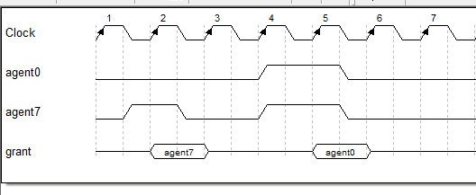

回到仲裁器本身，在设计模块时我们需要考虑模块的输入、输出和功能；此时输入、输出已经明了；输入为各个用户的请求（request），我们将其组合为一个多比特向量 `Req[x-1:0]`,它们之间的位次则表明其优先级大小；至于输出，则是仲裁所得的结果，也就是给用户的结果；一般来说这个结果因为要给到每个请求的用户，所以是一个 x 位的独热码，或者任何可以指示的信号；

现在问题来到了具体的仲裁器设计环节：如何在多个请求中选中优先级最高的那一个？这里我们可以仔细想一想；

**优先编码器！** 还记得数电中优先编码器如何描述的吗？

~~~verilog
// if-else-if 语句可以很好描述优先选择功能
if(req[0])
    grant <= 8'b0000_0001;
else if(req[1])
    grant <= 8'h0000_0010;
``````
~~~

~~~verilog
// 使用 case 当然也是可以的
case(1'b1) 
    req[0]:	grant <= 8'b0000_0001;
    req[1]: grant <= 8'b0000_0010;
    ````````
    default: grant <= 8'b0000_0000;
endcase
~~~

此时，让咱们设计一个 4-1、16-1 优先编码器是足够的；但我们希望我们设计出的代码可以有着更好的通用性；上面的代码在不同设备数的系统中需要修改代码；而若是设备数量多到手工写不过来时呢？我们自然希望我们的代码可以是参数化的，这样仅需要调用不同的参数便可以生成不同的电路，从而省去重复修改代码的麻烦事；参数化的代码在系统设计中是非常必要的；那现在我们当然知道写出上述的优先编码器是简单的，但如何写出参数化的优先编码器则不容易；

```verilog
// 如何参数化？
module priority_arbiter#(
	parameter	REQ_WIDTH = 16；
)(
    input	[REQ_WIDTH-1:0]	req,
    output	[REQ_WIDTH-1:0] grant
);
    //????????????
    // 内部该如何设计呢？
```

首先，if-else-if 和 case 语句中的内容是肯定不能自动重复的，这个是确定的；若是对 verilog 语法比较了解的，可能会快速的想到使用`for`循环来写；for 和 generate for 通常是我们用来简化大量重复的代码时使用的；

此时，我们可以这样写，请大家看一下下列的代码并**考虑一下为什么要使用 pre_req ？** 因为第 i 位的 grant 与之前的 req请求 有关；不使用 pre_req 的话，就需要对 i 之前的所有 req 进行检查；这样写将之前的信息累计起来，因为我们想知道的是，在 **i** 之前有没有 req 产生，所以使用或运算就可以；

```verilog
// 为什么要使用 pre_req ？
for(int i = 1; i < REQ_WIDTH; i = i + 1) begin
    grant[i] = req[i] & !pre_req[i-1];
    pre_req[i] = req[i] | pre_req[i-1];
end

//或者是
assign pre_req[0] = 1'b0;
assign pre_req[REQ_WIDTH-1:1] = req[REQ_WIDTH-2:0] | pre_req[REQ_WIDTH-2:0];
assign grant = req & ~pre_req;
```

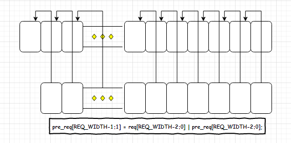

上述方法的本质，是使用 pre_req 存储之前的请求信息，作为 mask 掩码屏蔽掉之后的请求，从而产生正确的仲裁结果；关于 pre_req 产生的方式，实质上就是通过一段长的组合逻辑链条产生,**注意这里并不是组合逻辑回环，有些同学在看第二段电路时可能会有些迷糊，在电路中是坚决不允许出现组合逻辑回环的；**我们观察掩码产生的逻辑，会发现掩码与 req 向量息息相关；从高优先级开始算起（假设是 req [x-1:0] 中的低位），假设此时req[3] = 1; 那么 req[2:0] = 0；对于掩码来说，此时 pre_req[2:0] = 0；pre_req[3]和更高位都为 1；我们就定位到了 req 向量中最先产生 1 的位置；此时的功能就类似于优先编码器的功能；**而还有个我们很熟悉的操作也能定位到起始 1 的位置？**

我们的目的是为了定位到向量中最起始的 1，那么我们可以将原数 req -1；想想减 1 后会发生什么？低位的 0 会不断的向上借位，那么 起始 1 的那位会被借位为0，而低位的 0 则会因为借位而变为1； 此时我们只需将（req -1)取反，便可得到我们想要的掩码；其实就是取补码的操作；减一取反和取反加一的结果是一致的；

建议大家可以找几个数据，自己试一试，看看是不是这样的；那么最后的结果则是：

```verilog
assign grant = req & (~(req - 1));
```

总结一下：

```verilog
module fixed_prior_arbiter #(
	parameter REQ_WIDTH = 16
)(
    input	[REQ_WIDTH-1:0] req,
    output	[REQ_WIDTH-1:0] grant
);
    assign grant = req & (~(req -1));   
endmodule
```

哦，对了。前面跟大家挖了个坑，就是参数化的优先编码器问题；注意前面我们参数化产生的为独热码，且会产生较长的逻辑链路；给大家介绍另一种优先编码器；这个是一款开源 axi 代码里使用的优先编码器；

```verilog
parameter LEVELS = WIDTH > 2 ? $clog2(WIDTH) : 1;
parameter W = 2**LEVELS;

wire [W-1:0] input_padded = {{W-WIDTH{1'b0}}, input_unencoded};
wire [W/2-1:0] stage_valid[LEVELS-1:0];
wire [W/2-1:0] stage_enc[LEVELS-1:0];

generate
    genvar l, n;

    // process input bits; generate valid bit and encoded bit for each pair
    for (n = 0; n < W/2; n = n + 1) begin : loop_in
        assign stage_valid[0][n] = |input_padded[n*2+1:n*2];
        assign stage_enc[0][n] = !input_padded[n*2+0];
    end

    // compress down to single valid bit and encoded bus
    for (l = 1; l < LEVELS; l = l + 1) begin : loop_levels
        for (n = 0; n < W/(2*2**l); n = n + 1) begin : loop_compress
            assign stage_valid[l][n] = |stage_valid[l-1][n*2+1:n*2];
            assign stage_enc[l][(n+1)*(l+1)-1:n*(l+1)] = stage_valid[l-1][n*2+0] ? 
            {1'b0, stage_enc[l-1][(n*2+1)*l-1:(n*2+0)*l]} : {1'b1, stage_enc[l-1][(n*2+2)*l-1:(n*2+1)*l]};
        end
    end
    
	assign output_valid = stage_valid[LEVELS-1];
	assign output_encoded = stage_enc[LEVELS-1];
	assign output_unencoded = 1 << output_encoded;
    
endgenerate
```

现在希望大家在纸上将这个电路的结构试着自己画一下；看看能看出什么结果；将 valid 和 encode 都画一下试试；


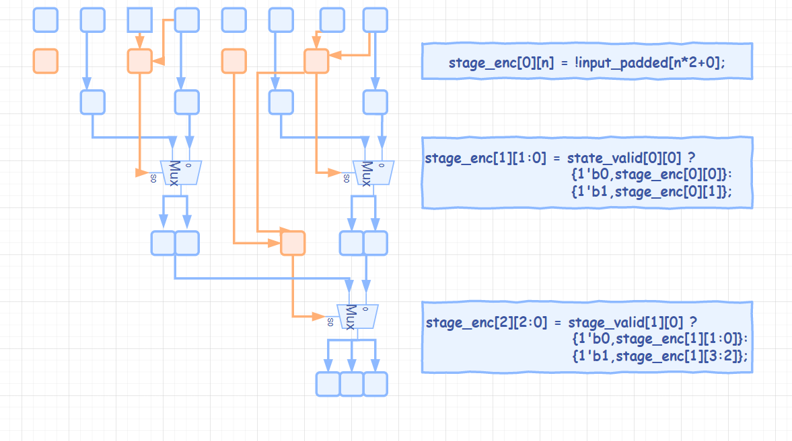

​	此种写法可以以指数级的速度减小关键路径的长度，但所用的代价是更多的物理资源；在设计中，资源的问题往往不大，但是速度却很难提升；所以希望大家能体会这一点；结构是一切的基础，verilog 只是硬件描述语言, 重要的在于体会设计的思想，了解我们设计的架构；


## Round Robin 轮询仲裁器

我们之前讲过，固定优先级相比轮询仲裁，最大的不同在于轮询仲裁在每次仲裁之后，优先级会改变；在各个用户之间会更加公平（不是说轮询仲裁更好，具体看使用场景）。固定优先级仲裁的一个问题就是公平性。还是用同学举手老师点名的例子来说，如果老师每次都叫学号小的，那学号大的同学会觉得不公平，因为被老师点到的机会小。单纯回答问题的话可能还好，如果我们假设每回答一个问题积一分，最后成绩按照回答问题的个数来计算的话，那么很显然这种方式对学号大的同学太不公平了。所以，仲裁器的公平性问题是在设计中我们必须要考虑的。

**轮询仲裁 round robin 就是考虑到公平性的一种仲裁算法，其基本思路是当一个用户得到了许可 grant 之后，他的优先级则在接下来的仲裁中变成了最低。**也就是说每个请求的优先级不是固定的，并会根据其他用户的许可情况动态调整。当有多个用户时，仲裁器可以依次授权给每个用户。

我们举一个例子，假设现在一共有4个请求；下表中 **req[3:0]** 是请求向量，**RR Priority** 是当前的优先级； **Grant** 则是本次仲裁的授权；

|        | Req[3:0] | RR Priority | Grant[3:0] |
| ------ | -------- | ----------- | ---------- |
| Cycle0 | 1111     | 3210        | 0001       |
| Cycle1 | 1111     | 2103        | 0010       |
| Cycle2 | 1111     | 1032        | 0100       |
| Cycle3 | 1111     | 0321        | 1000       |
| Cycle4 | 0000     | 3210        | 0000       |
| Cycle5 | 0100     | 3210        | 0100       |
| Cycle6 |          | 0321        |            |

注意 轮询仲裁说的只是优先级会随着仲裁结果的出现而改变；**并不意味着此次仲裁结果为 req[0], 那么下一次就一定得是 req[1]。**这样的设计是不对的，效率不高，且有死锁的风险；**轮询是说, 在这次授权结束之后, 仲裁器将会以新的优先级开始仲裁，若没有请求，也就是每仲裁结果的话，优先级是不变的；**仔细观察上表中优先级的变化, 尤其是 Cycle5 到 Cycle6 的这次变化；

大家可以思考一下，该如何处理优先级类似的变化?

轮询有点类似于 **转轮** 类似的工具，在某次之后，该位置则会在下一个周期才能轮到；这是不是有点像我们刚才的轮询状态；那么我们如何才能在电路中实现这样的功能呢？还记得 **Verilog 中的 移位 & 循环移位吗**？这里大家可以先想一下，可以从哪里入手完成这样的功能；

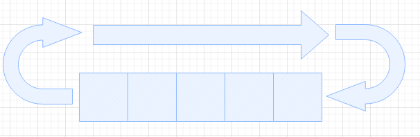

首先应该想到的是，RR 既然代表的是优先级的轮转，那么这个优先级在仲裁模块中，应该在哪里被体现？换句话说，这个优先级如何在模块中发挥作用？仔细想想上一节中的固定优先级仲裁器，优先级体现在哪？ req 向量的排列次序上，对吧；那现在联系到 **移位操作**，我们应当在脑子中快速的想到这样的一段代码。对吧，和上面的表像不像？很直观，对吧；但是··················这怎么参数化呢？我们之前说到参数化是一种更高的抽象层次；

```verilog
if(grant[0] == 1'b1)
    req_nxt <= {req[0],req[3],req[2],req[1]};
else if(grant[1] == 1'b1)
    req_nxt <= {req[1],req[0],req[3],req[2]};
else if(grant[2] == 1'b1)
    req_nxt <= {req[2],req[1],req[0],req[3]};
else if(grant[3] == 1'b1)
    req_nxt <= {req[3],req[2],req[1],req[0]};
```

这样的一种结构，后面接上之前提到过的固定优先级仲裁器，不就可以完成了轮询仲裁的任务，那么整个电路的结构应该就是下面这样子的；但我们之前提到过参数化是我们在编写模块时很重要的一步，重要的是我们该如何将上述的思想参数化表达？


显然这不是一件容易的事情；还记得我们之前讲的 mask 吗？当一个人完不成工作的时候，最优解当然是两个人一起干；现在我们回忆一下，之前的一行代码：

```verilog
assign pre_req[REQ_WIDTH-1:1] = req[REQ_WIDTH-2:0] | pre_req[REQ_WIDTH-2:0];
```

这里的 `pre_req` 是什么意思？ 从检测到了第一个 1 开始，后面的是不是就全部是 1 了？假设 这个 1 在第 i 位，那么 pre_req 的第 i+1 位和之后都是 1；这不正是我们要寻找的 mask 吗？我们刚好可以把轮询过的那些 req 给屏蔽掉，将 mask 与 req 相与就行，这样下来我们就能得到新的 req；但这 new_req 并不完整，因为少了前半部分；也就是被挪走的部分；该如何做？注意 mask 的特点，我们使用 **mask** 屏蔽掉优先级小的那部分，自然也能使用 **（~mask）** 屏蔽掉优先级大的那部分；对吧？这时候我们只需要在这新的 new_req_1 和 new_req_2 之间选择一个送往后续的固定优先级仲裁器即可；该如何选择？那肯定是高优先级的那一部分都不存在 req 喽；只需要将使用  mask 屏蔽之后的 req 向量相互之间 **或** 起来，作为选择信号，那不就可以啦？下来我们试着画一下这样的结构；

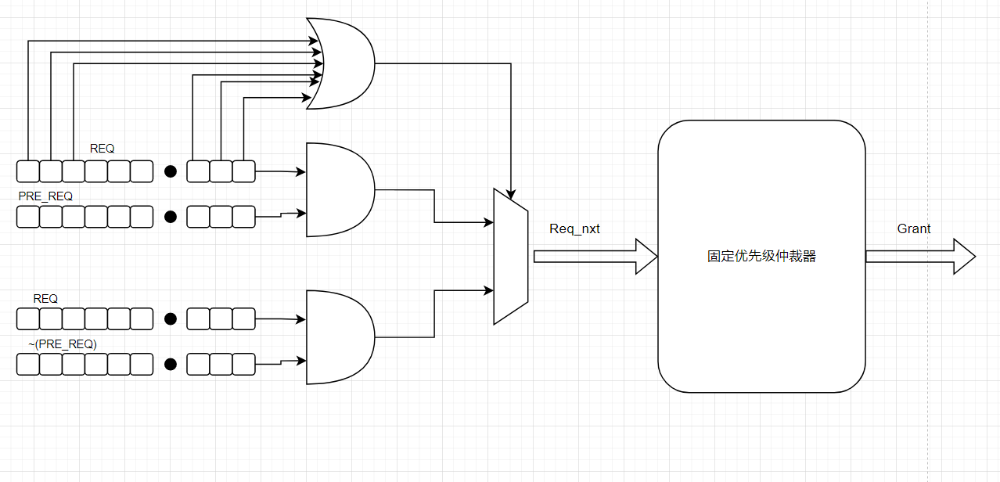

事实上，我们的思路已经非常非常接近于在现在一些项目中用到的轮询仲裁器的设计思维；但是，我不准备现在就把代码给大家放出来；走一些弯路并不是一点用处都没有的；打个比方，如果这里不提醒的话，我们能想到还能这么设计的吗？现在请大家想一想，如果不使用这种结构，如何再设计出一种轮询结构？

在上述的思路中，我们的重点在于如何是将请求 req 按照优先级的体现而重新排序；现在我们考虑新的思路，**轮询需要的信息是什么？** 上一轮的仲裁结果对吧；对于 pre_req 来说，其实也就是上一轮的结果；那么，让我们忘掉上述的结构；我们该怎么设计一个仲裁器，输入为 这一次的 REQ  和 上一次的 GRANT，输出为这一次的 grant；这个模块若是按照轮询仲裁的规则来工作，便自然是一个轮询仲裁器；

现在我们的输入是 req[3:0] 和 pre_grant[3:0]；而 grant 是前面我们仲裁出来的独热码；考虑一下，我们得出 grant 的过程：

```verilog
assign grant = req & （~（pre_req));
// or?????
assign grant = req & (~(req - 1'b1));
```

还记得 pre_req 是怎么得到的吗? 还记得为什么要 (req - 1'b1) 吗？为了找到最开始的那个 “1”；那么如何找到从 grant 之后开始的那个 “1” 呢？

**很简单，减掉 (grant << 1)就行；就和从第 0 位开始减掉 2^0 一样；**大家可以自己试一试是不是这样的；注意此时我们 & 的是它的非；要注意到此时的 req 可能小于 grant，所以我们给 req 拓展；具体看下面的代码；

```verilog
wire [2*num_req-1:0] double_req = {req,req};
wire [2*num_req-1:0] double_gnt = double_req & ~(double_req - base);
assign  gnt = double_gnt[num_req-1:0] | double_gnt[2*num_req-1:num_req];
```

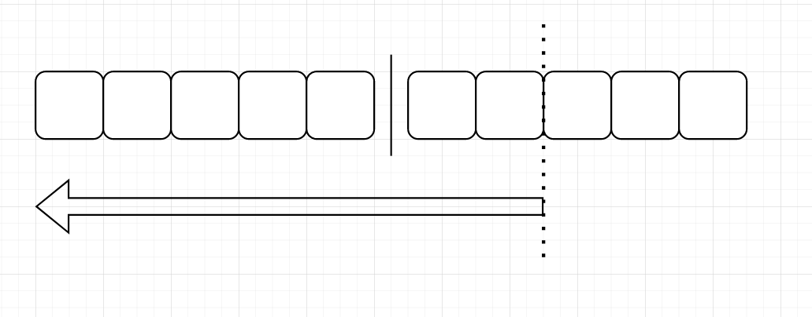

那么，此时优先级的排列刚好就等于我们上述所说的，最后将两部分相与，取出正确的结果；上面的设计思路简单，明了；代码也仅仅只需要 3 行就能描述；但是他有他的问题，导致大家在使用时不常使用；主要是在面积与时序方面有着缺陷；拓展的 req 使得关键路径成倍的增长；同时因为内部变量的拓展，使得运算的资源也成倍增长；而且 req 越长，这个状态就越差；这个大家应该都是可以理解的吧；同时我们分析一下第一种方案；

 pre_req 也就是 mask 可以使用上一轮寄存的结果， & 操作只增加了 1 级逻辑；选择器这里也只多了一两层逻辑；相比较上个方案的倍数增长来说，这个对于面积与时序的增加是固定的值，固定值比起上一个方案倍数增加的效果那是不知道高到哪里去了；所以这就是我们不选择上述方案而常用这种方案的原因；此外还记得咱们上面讲的优先编码器吗？有看出这两个模块之间的思想有什么相似之处吗？

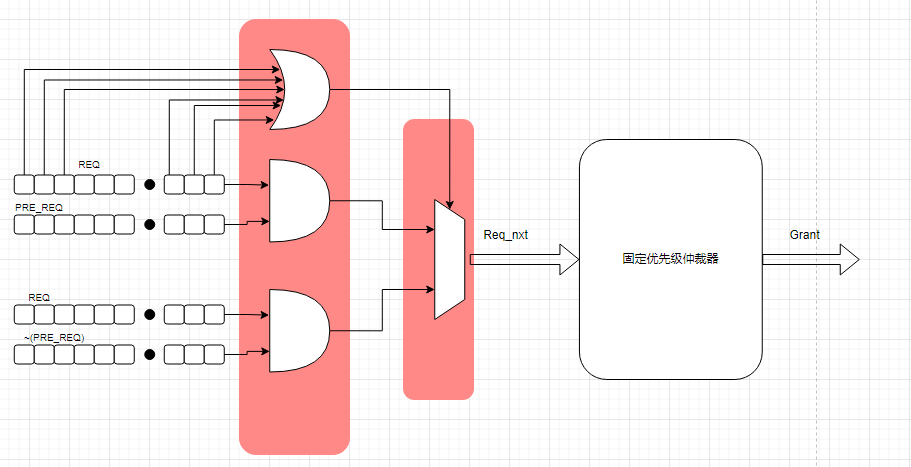

好吧，让我们再看看前面的优先编码器；


请注意我在这里圈出的两处部分，小圈内的是将 2 位编码为 1 位结果；大圈内的结构将 4 位输入编码为 2 位结果；大家看出什么了？ **注意四位的编码器其实是由两个两位的结构组成了。** 请大家再看看整个大的结构，8位的编码结构实质上是由 2 个 4位的编码结构构成的，如果需要16位的优先编码器，那么我们可以通过2个8位的编码器合并得到；为什么可以这样？

我们可以明显的观察到，对于优先级编码，一位肯定是不用编码的；**首先**，对于输入最少的 2位来说，编码后结果为 1 位；将优先级高的那位取反则可得结果；但是因为会有输入无效的情况 （**00、01和11、10**），位宽为 1 位时我们表达的信息量明显不够，所以我们需要额外的 valid 位，也就是上图的橙色部分；这个操作明显是非常简单的；**其次**，对于所有的输入来说，最后明显的都可以拆分为多个 2输入的情况；**第三**，分解之后的结果组合起来可以作为总和的结果；

所以仔细想想我们刚才的轮询仲裁器，在上次仲裁的位置开始划分，前后两个部分刚好就是两个固定优先级的仲裁器；而这两个固定优先级的仲裁结果合起来则正是此次仲裁出的结果；而当轮询仲裁划分为两个固定优先级仲裁时，解决问题的复杂度也降低了；现在我们将完整的代码写出来：

```verilog
// ack 开始，keep释放，在下一拍读入新的 req	
	always@(posedge clk or negedge rst_n)begin
		if(!rst_n)begin
			keep <= 1'b0;
		end else begin
			if(ack)begin
				keep <= 1'b0;
			end
			else if(|req)begin
				keep <= 1'b1;
             end
         end
	always@(posedge clk or negedge rst_n)begin
		if(!rst_n)begin
			req_keep <= {P_WIDTH{1'b0}};
		end else begin
			if(!keep)begin
				req_keep <= req;
			end
		end
	end
// ture_req 通过 keep 来选择。	
	assign ture_req = keep ? req_keep : req;
		
	assign req_a = mask & true_req;
	assign req_b = (~mask) & true_req;
	assign mask_a=((~req_a) + {{(P_WIDTH-1){1'b0}},1'b1}) ^ req_a;
	assign mask_b=((~req_b) + {{(P_WIDTH-1){1'b0}},1'b1}) ^ req_b;
	assign grant_a = ~mask_a & req_a;
	assign grant_b = ~mask_b & req_b;
	assign grant = (|req_a)? grant_a : grant_b;
	
	always@(posedge clk or negedge rst_n)begin
		if(!rst_n)begin
			mask <= {P_WIDTH{1'b0}};
		end else begin
			if(ack)begin
				mask <= (|req_a)? mask_a : mask_b;
			end
		end
	end
endmodule
```


## 带权轮询仲裁器 Weighted Round Robin

我们来讨论仲裁器的设计方案；对于一般的系统来说，使用优先级仲裁和轮询仲裁应该是足够的；但是，需求并不是一成不变的；对于不同的系统，根据需求设计不同的仲裁方案是必须的；优先级仲裁代表着绝对的不公平，轮询仲裁在仲裁之后的优先级会掉到最低，绝对公平；但是有时系统内的模块各自的重要性都不相同，有时候各个用户对资源的访问频率和要求也各不相同；所以，在这种情况下，使用固定优先级算法与轮询仲裁都不合适；此时，带权重的轮询便自然产生了；

还是以上课老师提问同学举手作为例子；在课堂上，老师肯定会偏向于平时表现良好的同学作答，但是老师也并不是全不叫学习差的同学回答；所以，在同学们都举手时，老师一般会有较大的几率选择好学生；这其实就是一种带权仲裁，权重在这里表现为被点到的概率；但请大家想一想，在电路中这个权重是如何体现出来的？ 概率是肯定不可能的，除非有特殊的电路结构才能表达出来，但这不是我们能接触到的；

关于权重的分配，一般来说有两种，以某个用户一次仲裁中或得的使用次数来划分，或者是以时间来划分；我们主要在讨论的是为每个用户分配一个轮询周期内它所能获得的许可次数；例如，用户0 的权重是 3，用户1 的权重是 2，用户3 的权重是 1，那么指的是当用户0 有请求时，为用户0 分配3 次。三次分配完后，这一仲裁周期便不再为用户 0 给出许可；这种方法的实现方式是给每一路请求维护一个计数器，当用户得到授权后，便将值减去1；为 0 之后，变不在管这一路；总的来说，一般有两种方法处理这样的请求：①：一个用户连续获得请求，即许可是以 ( A A A B B C) 的形式发出的；②再有许可的用户之间公平轮询，即许可是以 （ A B C A B A) 的顺序发出的；

因为第一种比较简单，我们主要看第一种；大家可以思考一下，该如何去设计这样的系统？

还记得我们是如何设计轮询仲裁的吗？首先，我们需要理解，轮询在具体的设计中体现在哪里？优先级的轮转上，是吧；那么，带权的权主要能体现在哪里？还是优先级；具体就是，只要优先级高的用户权重不为 0 ，那么优先级高的用户请求就不会被屏蔽是吧；记得我们是如何设计轮询那张图吗？我们在优先级仲裁的基础上为请求向量添加了掩码，将轮询仲裁划分为了两个独立的优先级固定的仲裁；想想带权的轮询相比轮询的改动在哪里？


在 mask 上；它和 round-robin 不同的是对于 mask 的调整。回想一下，round-robin 里的 mask 规则是，只要第 i 路被许可，那么从第 0 路到第 i 路的 req 都会被 mask 掉， 只允许更高为的 request 通过，然后输出时选择仲裁结果；但是对于带权 weighted round-robin，一次 grant 不足以立刻让这一路被 request 被屏蔽掉，而是要看这里的权值，如果还没有减为0，那么这一路就不会被屏蔽；当权值被减少到 1 之后，那么我们就可以不管这一路之后的请求，此刻按照一般轮询的规则转换到下一个请求；

一般来说，当所有的路都被 mask 掉，就是说所有的路都被依次轮过一遍，这个时候我们需要再来一轮公平的仲裁，大家都各自载入自己的权重，重新开始；或者是，没有 active req，也就是当仲裁权被释放后，没有新的请求进来，这样我们视为一次仲裁周期已经结束，可以重新加载权重了；

上面两种情况合起来就是上图中 mask 之后的 req 全为 0；

大家可以想想该怎么实现，如果还有时间我们可以交流一下思路；

（其实，对于最开始设计的轮询仲裁来说，我们根据 weight 是否为 0 来决定减的是 grant >> 1 还是 grant 就可以得到正确的掩码；对于第二种将轮询仲裁拆分为两个优先级仲裁来说，此时根据 weight 判断是否要改变 上次的 mask 就可以了；）

## 参考资料：

[round robin arbitration | RTLery](http://www.rtlery.com/articles/round-robin-arbitration)

[[PDF\] Arbiters: design ideas and coding styles (researchgate.net)](https://www.researchgate.net/publication/228693610_Arbiters_design_ideas_and_coding_styles)


## LRU 算法与电路实现

介绍 LRU （最近最少使用算法 ）之前首先得介绍一下 cache，即高速缓冲存储器，是LRU 的重要的应用场景；大家都知道 cache 吧；cpu 再运行时，会把硬盘中的程序加载到内存中，从内存中读取当前的指令和数据进入 cpu 执行，然后将执行结果存入内存中；通常来说，为了更少的延迟，cpu会将一部分数据复制到 cache 中，以后访问该区域时就不用再从内存中取出。但是 cache 的容量很小，所以需要决定里 cache 里面保存的数据是关键的；那么，当新的数据需要写入时，就需要我们决定去舍弃哪一部分现有的数据；而依照数据的相关性，运行同一程序时，一段连续的数据通常会被多次调用；所以，最近不常使用的那些数据就是重要性相对不大的数据；那么， LRU 算法也就是在类似的场景下使用的；（调度、仲裁算法一定是因为有着具体的使用场景才会被研究发展的，这也进一步说明了我一直给大家说到，仲裁规则只是仲裁规则，规则只是代表一种行为方式，至于怎么实现规则，这个并不会被规则本身所约束；）

关于 LRU 算法的实现方式，目前搜集到的主要有两种：矩阵法 和 链表法；

**矩阵法** 会设计一个 NxN 的矩阵，每次当访问到某一项时，会将其那一行全置为 1，将其那一列全置为 0；见下图：

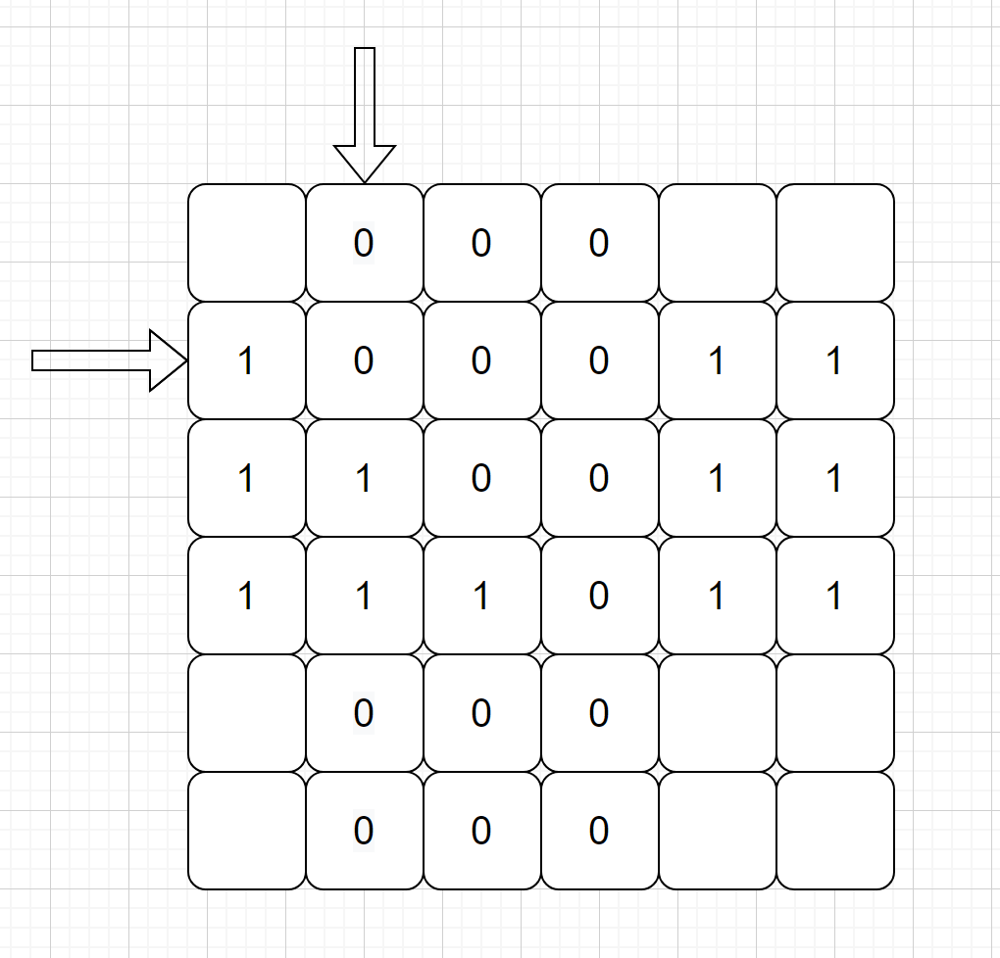

统计最近最少使用时，我们将对应项的那一行所有数值加起来，找出最少的那一行，就是目标值；其实很好理解，当访问到某一项时，一行会全置为1，但是在访问别的项目时，就将对应的竖列变为 0，实质上就是减少了别人的值，而这个值在访问到他之后又会重新复位。那么一段时间之后，谁的值最小，谁就是最近最少访问的表项。这个很容易懂；


**链表法** 当然上述的思想简单，但是在实现的时候不容易；主要是对于 N 个请求，我们需要 NxN 的空间，而一个查找的操作则需要先变值，在比较才能得到；那么需要改变存储信息的结构，节省时间和空间，降低算法复杂度；多使用链表法实现 lru 结构。双向链表是链表的拓展，我们可以看关于链表的下图：

双向链表就是一块数据既有前向的指针，又有后向的指针。所谓的这一串结构组成了双向的链表；但是在这个链表中查找资料在最坏情况下需要便利整个链；所以将首尾相连，延伸出环形链表；

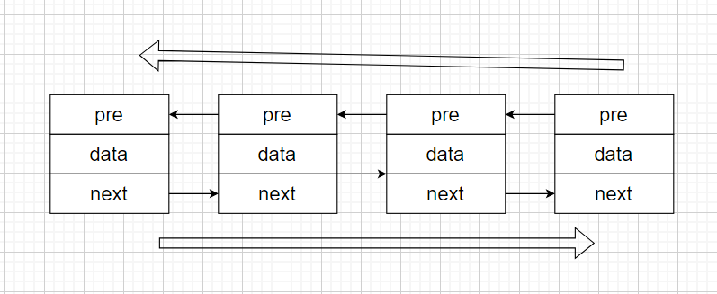

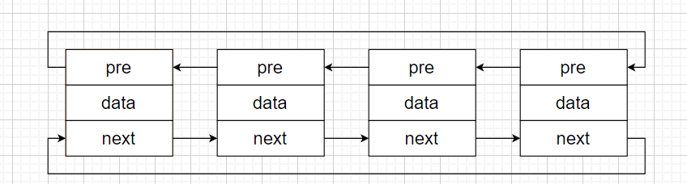

可能框图的表示不是太清楚，那么我么可以看下面的图，是不是很直观明了：

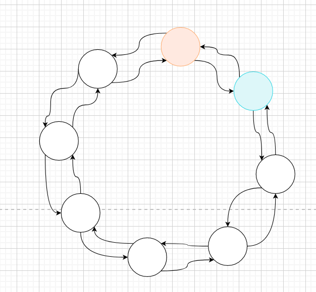

那么，使用链表法的实现 LRU 算法的思想主要是利用链表的结构，对于多长的表项，都只要固定的时间即可得到结果；使用链表法的顺序如下：

**第一步：**链表是有头节点的，上一块轮新加入的节点作为头节点，然后在本轮之后更新；

**第二步：**如果某一个表项被访问到，那么我们将这一表项抽取出来，这一项目前后的节点按顺序连接；

**第三步：**将这一节点插入到头节点之前，并将这一节点更新为头节点；

如果想要找出 LRU 法的结果，去查询头节点的前向指针即可；分析该算法，对于计算来说，只要知道头节点位置就可知道结果，算法的时间复杂度是固定的常数；

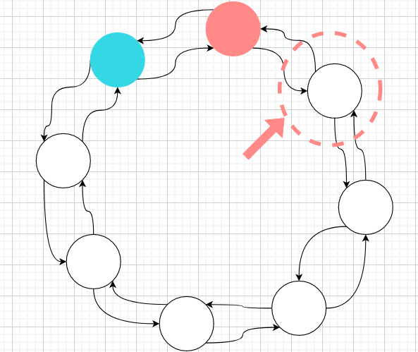

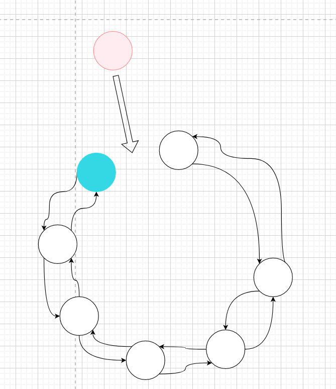


