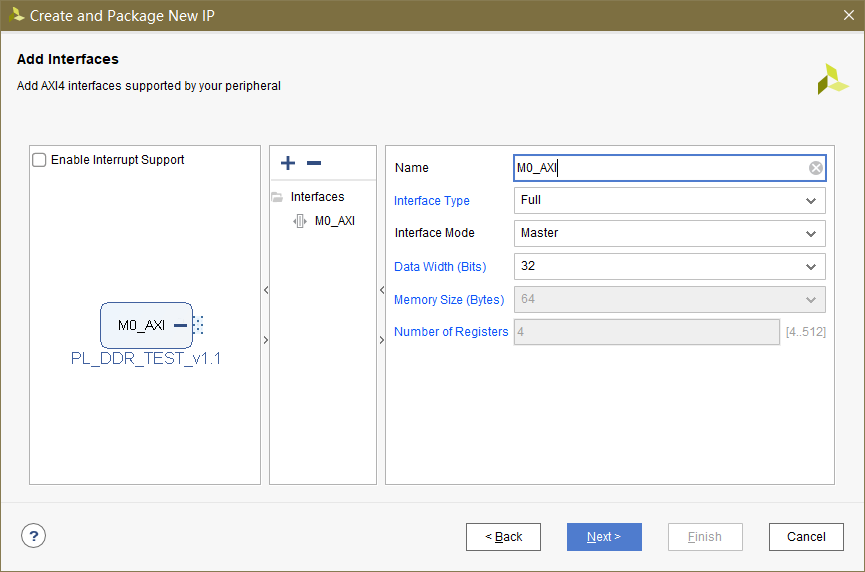
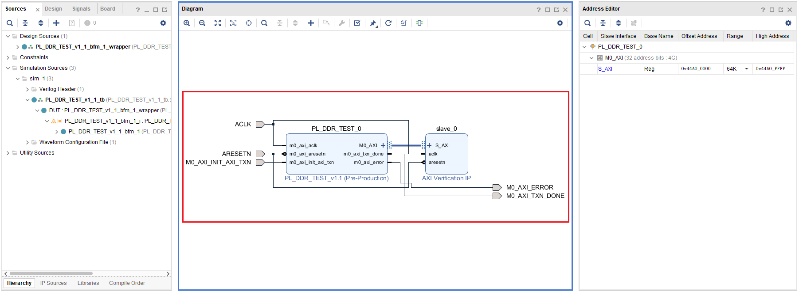
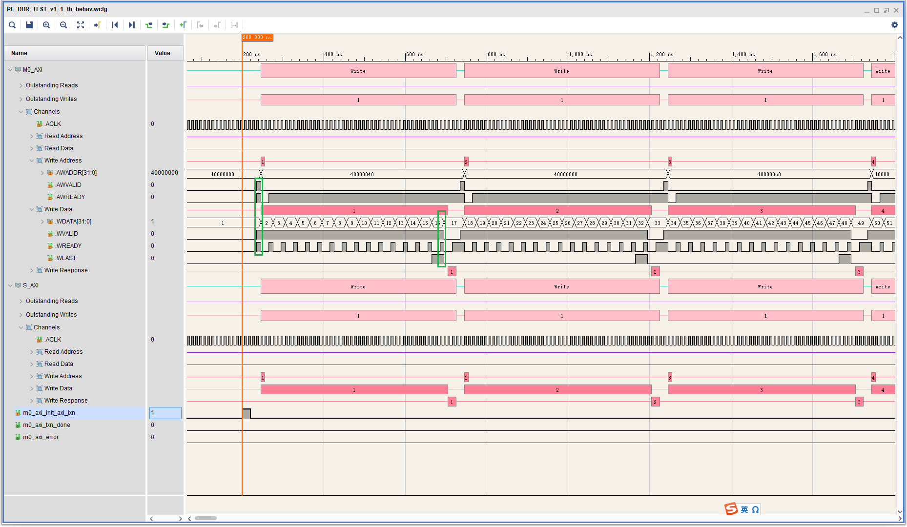
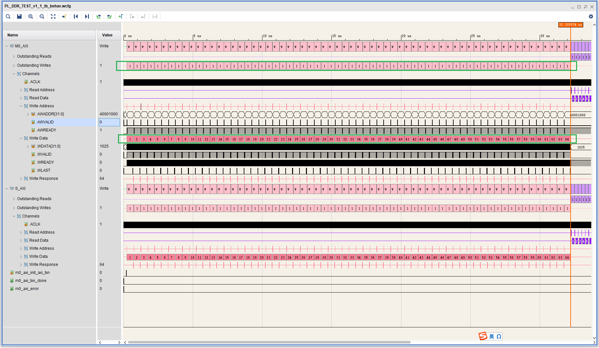
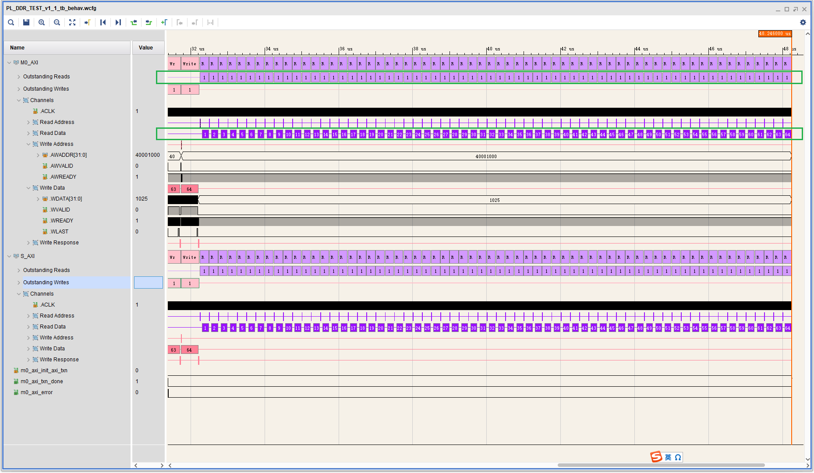
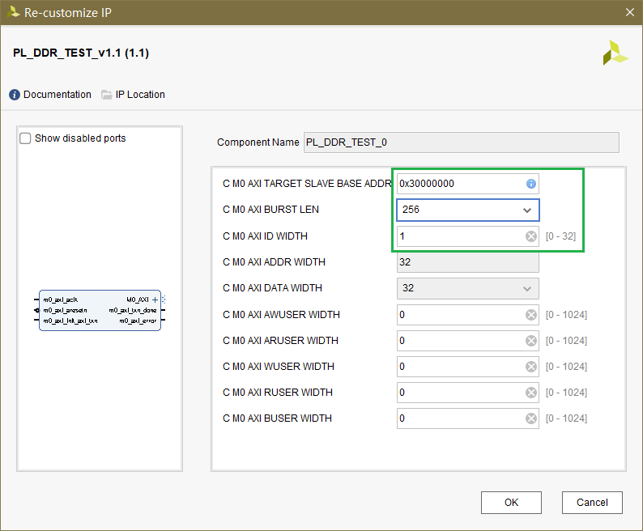
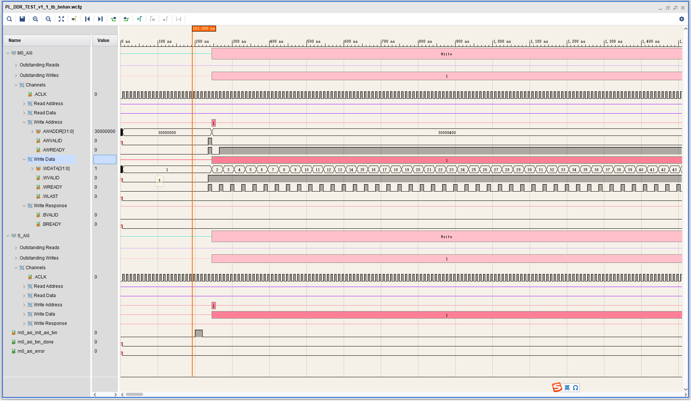
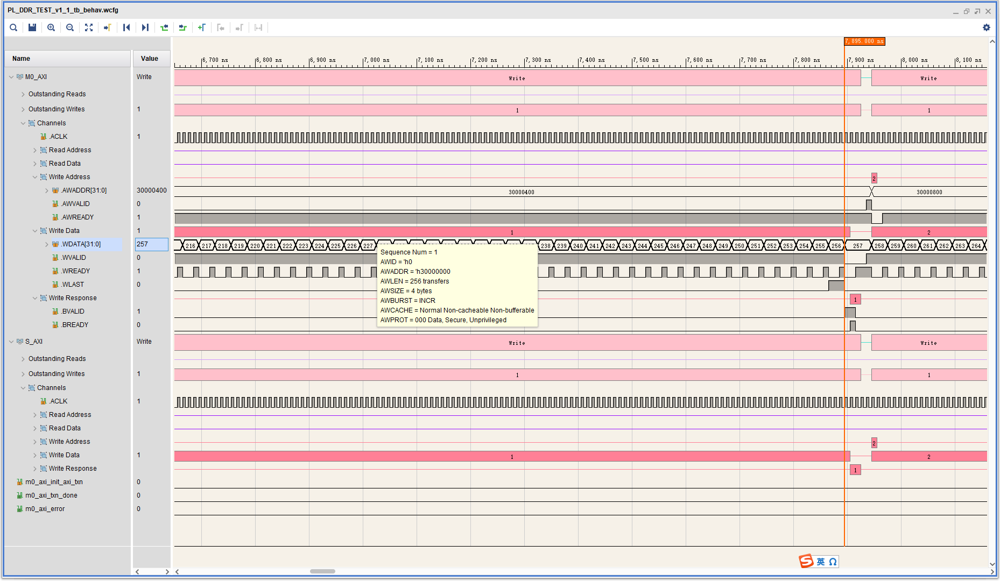
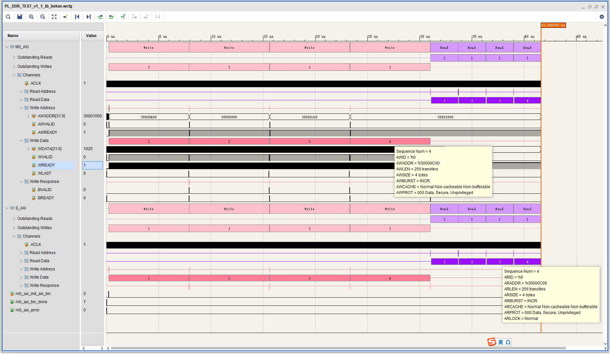
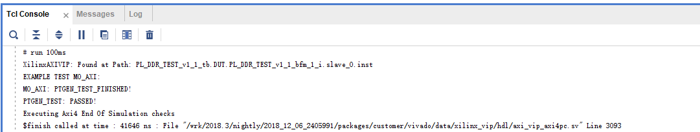

# 创建带AXI-Full主接口的IP并仿真

## 创建 

## 仿真

该示例工程的是基于Xilinx AXI VIP搭建的，其框图如下

该工程自带有用于仿真的`tb`文件，启动仿真后，我们添加如下信号进行观察，

可见，该自动构建的仿真例程做了下面的事情：

- 主机发起了64次突发写事务，突发的长度(握手次数)=16，每次握手传递的字节数=4，因此写数据总量为4KB
- 主机发起了64次突发读事务，突发的长度(握手次数)=16，每次握手传递的字节数=4，因此读数据总量为4KB
- 将每次的读结果与预期值进行对比，以`m0_axi_error`指示错误状态

接下来我们尝试对其IP核参数进行修改，包括：

- 主机发起了4次突发写事务，突发的长度(握手次数)=256，每次握手传递的字节数=4，因此写数据总量为4KB
- 主机发起了4次突发读事务，突发的长度(握手次数)=256，每次握手传递的字节数=4，因此读数据总量为4KB
- 将每次的读结果与预期值进行对比，以`m0_axi_error`错误状态

仿真结果如下

可以看到，增大了突发长度后，整体的数据传输效率有所提高。