# 创建带AXI-Lite从接口的IP并仿真

## 创建 

打开Vivado，创建一个新的IP库位置（即在所选路径下创建一个IP库管理工程）


创建并封装一个新的IP，

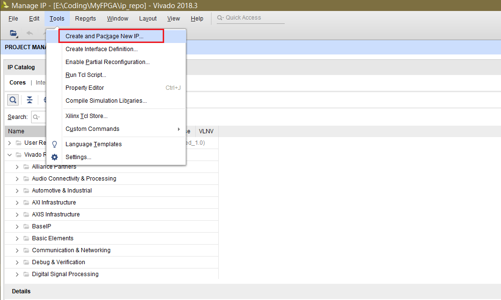

选择AXI4外设

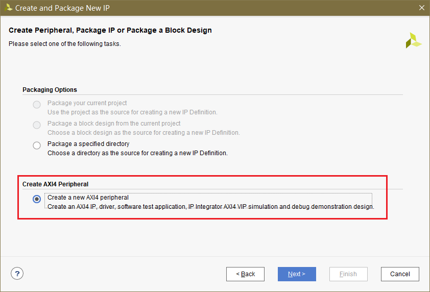

填写名称及版本号

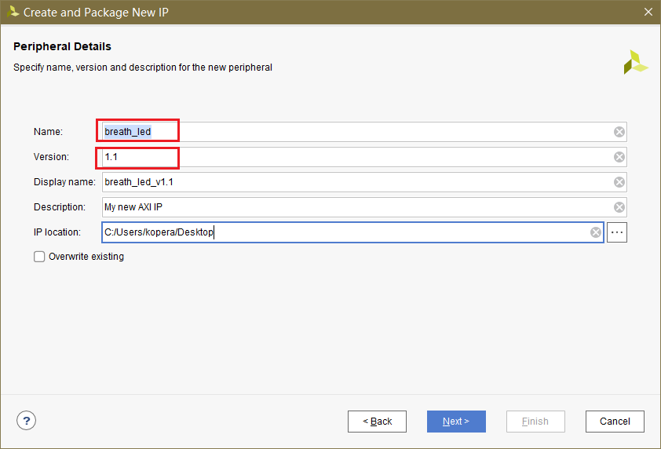

选择接口类型，填写接口名称，设置寄存器数量

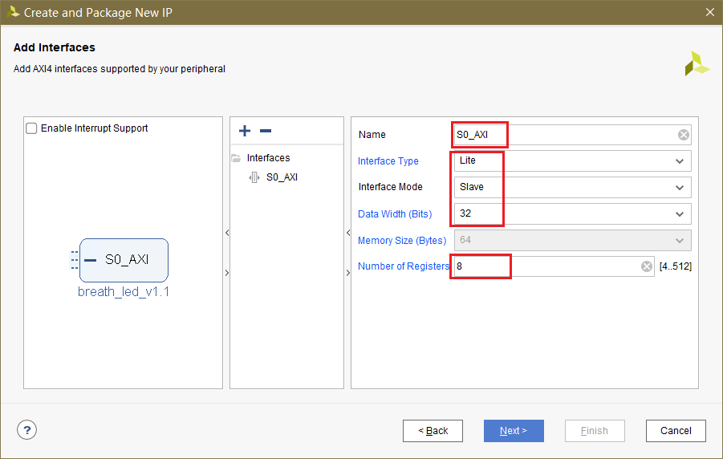

选择`Edit IP`,（将会创建一个IP核编辑工程）

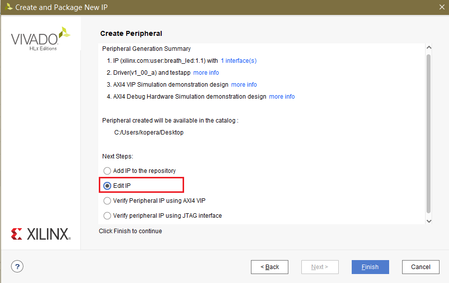

## 编辑

得到如下的IP核编辑工程，

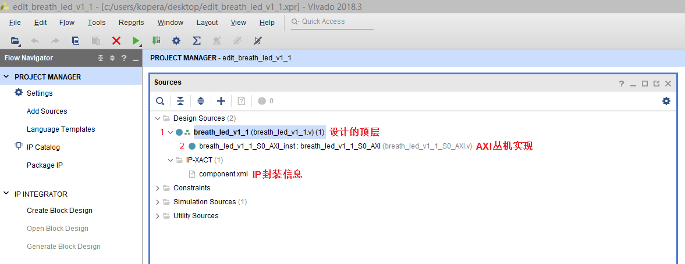

Xilinx的模板已经为我们实现了基于AXI协议的**通信基础设施**，模块1是对模块2的例化，在保留原有逻辑及接口的基础上，我们自己的逻辑和接口既可以添加在模块1中也可以添加在模块2中，

本例中，我们将一个具体实现呼吸灯效果的**功能模块**附加到已有的基础设施上。

在生成的IP目录下新建`src`，并将要添加的模块源码放入，

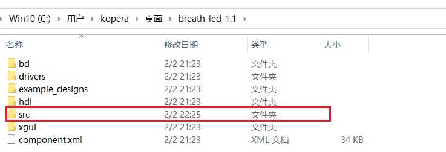

先附上所有代码：

`breath_led.v`

```verilog
//***********************    File Info     ************************
// Project Name  : breath_led_ip
// Module Name   : breath_led
// Created By    : kopera
// Description   :
// Verilog Mode  : IEEE-2005
// Character Set : GB-2312
//************************ Revision History ***********************
// Date       By        Version       Change Description
// -----------------------------------------------------------------
// 22/01/30   kopera    v0.1          first try
//*****************************************************************

`timescale 1ns/1ns
module breath_led #(
           parameter START_FREQ_STEP = 10'd100   //设置频率步长初始值
       )(
           input       sys_clk,       //时钟信号
           input       sys_rst_n,     //复位信号
           input       sw_ctrl,       //呼吸灯开关控制信号 1：亮 0:灭
           input       set_en,        //设置呼吸灯频率设置使能信号
           input [9:0] set_freq_step, //设置呼吸灯频率变化步长
           output      led            //LED
       );


//reg define
reg [15:0] period_cnt ; //周期计数器
reg [9:0] freq_step ; //呼吸灯频率间隔步长
reg [15:0] duty_cycle ; //设置高电平占空比的计数点
reg inc_dec_flag; //用于表示高电平占空比的计数值,是递增还是递减 //为 1 时表示占空比递减,为 0 时表示占空比递增

wire led_t ;
//将周期信号计数值与占空比计数值进行比较，以输出驱动 led 的 PWM 信号
assign led_t = ( period_cnt <= duty_cycle ) ? 1'b1 : 1'b0 ;
assign led = led_t & sw_ctrl;

//周期信号计数器在 0-50_000 之间计数
always @ (posedge sys_clk) begin
    if (!sys_rst_n)
        period_cnt <= 16'd0;
    else if(!sw_ctrl)
        period_cnt <= 16'd0;
    else if( period_cnt == 16'd50_000 )
        period_cnt <= 16'd0;
    else
        period_cnt <= period_cnt + 16'd1;
end

//设置频率间隔
always @(posedge sys_clk) begin
    if(!sys_rst_n)
        freq_step <= START_FREQ_STEP;
    else if(set_en) begin
        if(set_freq_step == 0)
            freq_step <= 10'd1;
        else if(set_freq_step >= 10'd1_000)
            freq_step <= 10'd1_000;
        else
            freq_step <= set_freq_step;
    end
end

//设定高电平占空比的计数值
always @(posedge sys_clk) begin
    if (sys_rst_n == 1'b0) begin
        duty_cycle <= 16'd0;
        inc_dec_flag <= 1'b0;
    end
    else if(!sw_ctrl) begin //呼吸灯开关关闭时，信号清零
        duty_cycle <= 16'd0;
        inc_dec_flag <= 1'b0;
    end
    //每次计数完了一个周期，就调节占空比计数值
    else if( period_cnt == 16'd50_000 ) begin
        if( inc_dec_flag ) begin //占空比递减
            if( duty_cycle == 16'd0 )
                inc_dec_flag <= 1'b0;
            else if(duty_cycle < freq_step)
                duty_cycle <= 16'd0;
            else
                duty_cycle <= duty_cycle - freq_step;
        end
        else begin //占空比递增
            if( duty_cycle >= 16'd50_000 )
                inc_dec_flag <= 1'b1;
            else
                duty_cycle <= duty_cycle + freq_step;
        end
    end
    else //未计数完一个周期时，占空比保持不变
        duty_cycle <= duty_cycle ;
end

endmodule
```

`breath_led_v1_1_S0_AXI.v`

```verilog

`timescale 1 ns / 1 ps

	module breath_led_v1_1_S0_AXI #
	(
		// Users to add parameters here
        parameter [9:0]   START_FREQ_STEP = 10'd100,   //设置频率步长初始值
		// User parameters ends
		// Do not modify the parameters beyond this line

		// Width of S_AXI data bus
		parameter integer C_S_AXI_DATA_WIDTH	= 32,
		// Width of S_AXI address bus
		parameter integer C_S_AXI_ADDR_WIDTH	= 5
	)
	(
		// Users to add ports here
        output wire led,
		// User ports ends
		// Do not modify the ports beyond this line

		// Global Clock Signal
		input wire  S_AXI_ACLK,
		// Global Reset Signal. This Signal is Active LOW
		input wire  S_AXI_ARESETN,
		// Write address (issued by master, acceped by Slave)
		input wire [C_S_AXI_ADDR_WIDTH-1 : 0] S_AXI_AWADDR,
		// Write channel Protection type. This signal indicates the
    		// privilege and security level of the transaction, and whether
    		// the transaction is a data access or an instruction access.
		input wire [2 : 0] S_AXI_AWPROT,
		// Write address valid. This signal indicates that the master signaling
    		// valid write address and control information.
		input wire  S_AXI_AWVALID,
		// Write address ready. This signal indicates that the slave is ready
    		// to accept an address and associated control signals.
		output wire  S_AXI_AWREADY,
		// Write data (issued by master, acceped by Slave) 
		input wire [C_S_AXI_DATA_WIDTH-1 : 0] S_AXI_WDATA,
		// Write strobes. This signal indicates which byte lanes hold
    		// valid data. There is one write strobe bit for each eight
    		// bits of the write data bus.    
		input wire [(C_S_AXI_DATA_WIDTH/8)-1 : 0] S_AXI_WSTRB,
		// Write valid. This signal indicates that valid write
    		// data and strobes are available.
		input wire  S_AXI_WVALID,
		// Write ready. This signal indicates that the slave
    		// can accept the write data.
		output wire  S_AXI_WREADY,
		// Write response. This signal indicates the status
    		// of the write transaction.
		output wire [1 : 0] S_AXI_BRESP,
		// Write response valid. This signal indicates that the channel
    		// is signaling a valid write response.
		output wire  S_AXI_BVALID,
		// Response ready. This signal indicates that the master
    		// can accept a write response.
		input wire  S_AXI_BREADY,
		// Read address (issued by master, acceped by Slave)
		input wire [C_S_AXI_ADDR_WIDTH-1 : 0] S_AXI_ARADDR,
		// Protection type. This signal indicates the privilege
    		// and security level of the transaction, and whether the
    		// transaction is a data access or an instruction access.
		input wire [2 : 0] S_AXI_ARPROT,
		// Read address valid. This signal indicates that the channel
    		// is signaling valid read address and control information.
		input wire  S_AXI_ARVALID,
		// Read address ready. This signal indicates that the slave is
    		// ready to accept an address and associated control signals.
		output wire  S_AXI_ARREADY,
		// Read data (issued by slave)
		output wire [C_S_AXI_DATA_WIDTH-1 : 0] S_AXI_RDATA,
		// Read response. This signal indicates the status of the
    		// read transfer.
		output wire [1 : 0] S_AXI_RRESP,
		// Read valid. This signal indicates that the channel is
    		// signaling the required read data.
		output wire  S_AXI_RVALID,
		// Read ready. This signal indicates that the master can
    		// accept the read data and response information.
		input wire  S_AXI_RREADY
	);

	// AXI4LITE signals
	reg [C_S_AXI_ADDR_WIDTH-1 : 0] 	axi_awaddr;
	reg  	axi_awready;
	reg  	axi_wready;
	reg [1 : 0] 	axi_bresp;
	reg  	axi_bvalid;
	reg [C_S_AXI_ADDR_WIDTH-1 : 0] 	axi_araddr;
	reg  	axi_arready;
	reg [C_S_AXI_DATA_WIDTH-1 : 0] 	axi_rdata;
	reg [1 : 0] 	axi_rresp;
	reg  	axi_rvalid;

	// Example-specific design signals
	// local parameter for addressing 32 bit / 64 bit C_S_AXI_DATA_WIDTH
	// ADDR_LSB is used for addressing 32/64 bit registers/memories
	// ADDR_LSB = 2 for 32 bits (n downto 2)
	// ADDR_LSB = 3 for 64 bits (n downto 3)
	localparam integer ADDR_LSB = (C_S_AXI_DATA_WIDTH/32) + 1;
	localparam integer OPT_MEM_ADDR_BITS = 2;
	//----------------------------------------------
	//-- Signals for user logic register space example
	//------------------------------------------------
	//-- Number of Slave Registers 8
	reg [C_S_AXI_DATA_WIDTH-1:0]	slv_reg0;
	reg [C_S_AXI_DATA_WIDTH-1:0]	slv_reg1;
	reg [C_S_AXI_DATA_WIDTH-1:0]	slv_reg2;
	reg [C_S_AXI_DATA_WIDTH-1:0]	slv_reg3;
	reg [C_S_AXI_DATA_WIDTH-1:0]	slv_reg4;
	reg [C_S_AXI_DATA_WIDTH-1:0]	slv_reg5;
	reg [C_S_AXI_DATA_WIDTH-1:0]	slv_reg6;
	reg [C_S_AXI_DATA_WIDTH-1:0]	slv_reg7;
	wire	 slv_reg_rden;
	wire	 slv_reg_wren;
	reg [C_S_AXI_DATA_WIDTH-1:0]	 reg_data_out;
	integer	 byte_index;
	reg	 aw_en;

	// I/O Connections assignments

	assign S_AXI_AWREADY	= axi_awready;
	assign S_AXI_WREADY	= axi_wready;
	assign S_AXI_BRESP	= axi_bresp;
	assign S_AXI_BVALID	= axi_bvalid;
	assign S_AXI_ARREADY	= axi_arready;
	assign S_AXI_RDATA	= axi_rdata;
	assign S_AXI_RRESP	= axi_rresp;
	assign S_AXI_RVALID	= axi_rvalid;
	// Implement axi_awready generation
	// axi_awready is asserted for one S_AXI_ACLK clock cycle when both
	// S_AXI_AWVALID and S_AXI_WVALID are asserted. axi_awready is
	// de-asserted when reset is low.

	always @( posedge S_AXI_ACLK )
	begin
	  if ( S_AXI_ARESETN == 1'b0 )
	    begin
	      axi_awready <= 1'b0;
	      aw_en <= 1'b1;
	    end 
	  else
	    begin    
	      if (~axi_awready && S_AXI_AWVALID && S_AXI_WVALID && aw_en)
	        begin
	          // slave is ready to accept write address when 
	          // there is a valid write address and write data
	          // on the write address and data bus. This design 
	          // expects no outstanding transactions. 
	          axi_awready <= 1'b1;
	          aw_en <= 1'b0;
	        end
	        else if (S_AXI_BREADY && axi_bvalid)
	            begin
	              aw_en <= 1'b1;
	              axi_awready <= 1'b0;
	            end
	      else           
	        begin
	          axi_awready <= 1'b0;
	        end
	    end 
	end       

	// Implement axi_awaddr latching
	// This process is used to latch the address when both 
	// S_AXI_AWVALID and S_AXI_WVALID are valid. 

	always @( posedge S_AXI_ACLK )
	begin
	  if ( S_AXI_ARESETN == 1'b0 )
	    begin
	      axi_awaddr <= 0;
	    end 
	  else
	    begin    
	      if (~axi_awready && S_AXI_AWVALID && S_AXI_WVALID && aw_en)
	        begin
	          // Write Address latching 
	          axi_awaddr <= S_AXI_AWADDR;
	        end
	    end 
	end       

	// Implement axi_wready generation
	// axi_wready is asserted for one S_AXI_ACLK clock cycle when both
	// S_AXI_AWVALID and S_AXI_WVALID are asserted. axi_wready is 
	// de-asserted when reset is low. 

	always @( posedge S_AXI_ACLK )
	begin
	  if ( S_AXI_ARESETN == 1'b0 )
	    begin
	      axi_wready <= 1'b0;
	    end 
	  else
	    begin    
	      if (~axi_wready && S_AXI_WVALID && S_AXI_AWVALID && aw_en )
	        begin
	          // slave is ready to accept write data when 
	          // there is a valid write address and write data
	          // on the write address and data bus. This design 
	          // expects no outstanding transactions. 
	          axi_wready <= 1'b1;
	        end
	      else
	        begin
	          axi_wready <= 1'b0;
	        end
	    end 
	end       

	// Implement memory mapped register select and write logic generation
	// The write data is accepted and written to memory mapped registers when
	// axi_awready, S_AXI_WVALID, axi_wready and S_AXI_WVALID are asserted. Write strobes are used to
	// select byte enables of slave registers while writing.
	// These registers are cleared when reset (active low) is applied.
	// Slave register write enable is asserted when valid address and data are available
	// and the slave is ready to accept the write address and write data.
	assign slv_reg_wren = axi_wready && S_AXI_WVALID && axi_awready && S_AXI_AWVALID;

	always @( posedge S_AXI_ACLK )
	begin
	  if ( S_AXI_ARESETN == 1'b0 )
	    begin
	      slv_reg0 <= 0;
	      slv_reg1 <= 0;
	      slv_reg2 <= 0;
	      slv_reg3 <= 0;
	      slv_reg4 <= 0;
	      slv_reg5 <= 0;
	      slv_reg6 <= 0;
	      slv_reg7 <= 0;
	    end 
	  else begin
	    if (slv_reg_wren)
	      begin
	        case ( axi_awaddr[ADDR_LSB+OPT_MEM_ADDR_BITS:ADDR_LSB] )
	          3'h0:
	            for ( byte_index = 0; byte_index <= (C_S_AXI_DATA_WIDTH/8)-1; byte_index = byte_index+1 )
	              if ( S_AXI_WSTRB[byte_index] == 1 ) begin
	                // Respective byte enables are asserted as per write strobes 
	                // Slave register 0
	                slv_reg0[(byte_index*8) +: 8] <= S_AXI_WDATA[(byte_index*8) +: 8];
	              end  
	          3'h1:
	            for ( byte_index = 0; byte_index <= (C_S_AXI_DATA_WIDTH/8)-1; byte_index = byte_index+1 )
	              if ( S_AXI_WSTRB[byte_index] == 1 ) begin
	                // Respective byte enables are asserted as per write strobes 
	                // Slave register 1
	                slv_reg1[(byte_index*8) +: 8] <= S_AXI_WDATA[(byte_index*8) +: 8];
	              end  
	          3'h2:
	            for ( byte_index = 0; byte_index <= (C_S_AXI_DATA_WIDTH/8)-1; byte_index = byte_index+1 )
	              if ( S_AXI_WSTRB[byte_index] == 1 ) begin
	                // Respective byte enables are asserted as per write strobes 
	                // Slave register 2
	                slv_reg2[(byte_index*8) +: 8] <= S_AXI_WDATA[(byte_index*8) +: 8];
	              end  
	          3'h3:
	            for ( byte_index = 0; byte_index <= (C_S_AXI_DATA_WIDTH/8)-1; byte_index = byte_index+1 )
	              if ( S_AXI_WSTRB[byte_index] == 1 ) begin
	                // Respective byte enables are asserted as per write strobes 
	                // Slave register 3
	                slv_reg3[(byte_index*8) +: 8] <= S_AXI_WDATA[(byte_index*8) +: 8];
	              end  
	          3'h4:
	            for ( byte_index = 0; byte_index <= (C_S_AXI_DATA_WIDTH/8)-1; byte_index = byte_index+1 )
	              if ( S_AXI_WSTRB[byte_index] == 1 ) begin
	                // Respective byte enables are asserted as per write strobes 
	                // Slave register 4
	                slv_reg4[(byte_index*8) +: 8] <= S_AXI_WDATA[(byte_index*8) +: 8];
	              end  
	          3'h5:
	            for ( byte_index = 0; byte_index <= (C_S_AXI_DATA_WIDTH/8)-1; byte_index = byte_index+1 )
	              if ( S_AXI_WSTRB[byte_index] == 1 ) begin
	                // Respective byte enables are asserted as per write strobes 
	                // Slave register 5
	                slv_reg5[(byte_index*8) +: 8] <= S_AXI_WDATA[(byte_index*8) +: 8];
	              end  
	          3'h6:
	            for ( byte_index = 0; byte_index <= (C_S_AXI_DATA_WIDTH/8)-1; byte_index = byte_index+1 )
	              if ( S_AXI_WSTRB[byte_index] == 1 ) begin
	                // Respective byte enables are asserted as per write strobes 
	                // Slave register 6
	                slv_reg6[(byte_index*8) +: 8] <= S_AXI_WDATA[(byte_index*8) +: 8];
	              end  
	          3'h7:
	            for ( byte_index = 0; byte_index <= (C_S_AXI_DATA_WIDTH/8)-1; byte_index = byte_index+1 )
	              if ( S_AXI_WSTRB[byte_index] == 1 ) begin
	                // Respective byte enables are asserted as per write strobes 
	                // Slave register 7
	                slv_reg7[(byte_index*8) +: 8] <= S_AXI_WDATA[(byte_index*8) +: 8];
	              end  
	          default : begin
	                      slv_reg0 <= slv_reg0;
	                      slv_reg1 <= slv_reg1;
	                      slv_reg2 <= slv_reg2;
	                      slv_reg3 <= slv_reg3;
	                      slv_reg4 <= slv_reg4;
	                      slv_reg5 <= slv_reg5;
	                      slv_reg6 <= slv_reg6;
	                      slv_reg7 <= slv_reg7;
	                    end
	        endcase
	      end
	  end
	end    

	// Implement write response logic generation
	// The write response and response valid signals are asserted by the slave 
	// when axi_wready, S_AXI_WVALID, axi_wready and S_AXI_WVALID are asserted.  
	// This marks the acceptance of address and indicates the status of 
	// write transaction.

	always @( posedge S_AXI_ACLK )
	begin
	  if ( S_AXI_ARESETN == 1'b0 )
	    begin
	      axi_bvalid  <= 0;
	      axi_bresp   <= 2'b0;
	    end 
	  else
	    begin    
	      if (axi_awready && S_AXI_AWVALID && ~axi_bvalid && axi_wready && S_AXI_WVALID)
	        begin
	          // indicates a valid write response is available
	          axi_bvalid <= 1'b1;
	          axi_bresp  <= 2'b0; // 'OKAY' response 
	        end                   // work error responses in future
	      else
	        begin
	          if (S_AXI_BREADY && axi_bvalid) 
	            //check if bready is asserted while bvalid is high) 
	            //(there is a possibility that bready is always asserted high)   
	            begin
	              axi_bvalid <= 1'b0; 
	            end  
	        end
	    end
	end   

	// Implement axi_arready generation
	// axi_arready is asserted for one S_AXI_ACLK clock cycle when
	// S_AXI_ARVALID is asserted. axi_awready is 
	// de-asserted when reset (active low) is asserted. 
	// The read address is also latched when S_AXI_ARVALID is 
	// asserted. axi_araddr is reset to zero on reset assertion.

	always @( posedge S_AXI_ACLK )
	begin
	  if ( S_AXI_ARESETN == 1'b0 )
	    begin
	      axi_arready <= 1'b0;
	      axi_araddr  <= 32'b0;
	    end 
	  else
	    begin    
	      if (~axi_arready && S_AXI_ARVALID)
	        begin
	          // indicates that the slave has acceped the valid read address
	          axi_arready <= 1'b1;
	          // Read address latching
	          axi_araddr  <= S_AXI_ARADDR;
	        end
	      else
	        begin
	          axi_arready <= 1'b0;
	        end
	    end 
	end       

	// Implement axi_arvalid generation
	// axi_rvalid is asserted for one S_AXI_ACLK clock cycle when both 
	// S_AXI_ARVALID and axi_arready are asserted. The slave registers 
	// data are available on the axi_rdata bus at this instance. The 
	// assertion of axi_rvalid marks the validity of read data on the 
	// bus and axi_rresp indicates the status of read transaction.axi_rvalid 
	// is deasserted on reset (active low). axi_rresp and axi_rdata are 
	// cleared to zero on reset (active low).  
	always @( posedge S_AXI_ACLK )
	begin
	  if ( S_AXI_ARESETN == 1'b0 )
	    begin
	      axi_rvalid <= 0;
	      axi_rresp  <= 0;
	    end 
	  else
	    begin    
	      if (axi_arready && S_AXI_ARVALID && ~axi_rvalid)
	        begin
	          // Valid read data is available at the read data bus
	          axi_rvalid <= 1'b1;
	          axi_rresp  <= 2'b0; // 'OKAY' response
	        end   
	      else if (axi_rvalid && S_AXI_RREADY)
	        begin
	          // Read data is accepted by the master
	          axi_rvalid <= 1'b0;
	        end                
	    end
	end    

	// Implement memory mapped register select and read logic generation
	// Slave register read enable is asserted when valid address is available
	// and the slave is ready to accept the read address.
	assign slv_reg_rden = axi_arready & S_AXI_ARVALID & ~axi_rvalid;
	always @(*)
	begin
	      // Address decoding for reading registers
	      case ( axi_araddr[ADDR_LSB+OPT_MEM_ADDR_BITS:ADDR_LSB] )
	        3'h0   : reg_data_out <= slv_reg0;
	        3'h1   : reg_data_out <= slv_reg1;
	        3'h2   : reg_data_out <= slv_reg2;
	        3'h3   : reg_data_out <= slv_reg3;
	        3'h4   : reg_data_out <= slv_reg4;
	        3'h5   : reg_data_out <= slv_reg5;
	        3'h6   : reg_data_out <= slv_reg6;
	        3'h7   : reg_data_out <= slv_reg7;
	        default : reg_data_out <= 0;
	      endcase
	end

	// Output register or memory read data
	always @( posedge S_AXI_ACLK )
	begin
	  if ( S_AXI_ARESETN == 1'b0 )
	    begin
	      axi_rdata  <= 0;
	    end 
	  else
	    begin    
	      // When there is a valid read address (S_AXI_ARVALID) with 
	      // acceptance of read address by the slave (axi_arready), 
	      // output the read dada 
	      if (slv_reg_rden)
	        begin
	          axi_rdata <= reg_data_out;     // register read data
	        end   
	    end
	end    

	// Add user logic here
    breath_led #(
        .START_FREQ_STEP ( START_FREQ_STEP ))
    u_breath_led (
        .sys_clk          ( S_AXI_ACLK    ),
        .sys_rst_n        ( S_AXI_ARESETN ),
        .sw_ctrl          ( slv_reg0[0]   ),
        .set_en           ( slv_reg1[30]  ),
        .set_freq_step    ( slv_reg1[9:0] ),

        .led              ( led           )
    );
	// User logic ends

	endmodule
```

`breath_led_v1_1.v`

```verilog

`timescale 1 ns / 1 ps

	module breath_led_v1_1 #
	(
		// Users to add parameters here
		parameter [9:0]   START_FREQ_STEP = 10'd100,   //设置频率步长初始值
		// User parameters ends
		// Do not modify the parameters beyond this line


		// Parameters of Axi Slave Bus Interface S0_AXI
		parameter integer C_S0_AXI_DATA_WIDTH	= 32,
		parameter integer C_S0_AXI_ADDR_WIDTH	= 5
	)
	(
		// Users to add ports here
		output wire led,
		// User ports ends
		// Do not modify the ports beyond this line


		// Ports of Axi Slave Bus Interface S0_AXI
		input wire  s0_axi_aclk,
		input wire  s0_axi_aresetn,
		input wire [C_S0_AXI_ADDR_WIDTH-1 : 0] s0_axi_awaddr,
		input wire [2 : 0] s0_axi_awprot,
		input wire  s0_axi_awvalid,
		output wire  s0_axi_awready,
		input wire [C_S0_AXI_DATA_WIDTH-1 : 0] s0_axi_wdata,
		input wire [(C_S0_AXI_DATA_WIDTH/8)-1 : 0] s0_axi_wstrb,
		input wire  s0_axi_wvalid,
		output wire  s0_axi_wready,
		output wire [1 : 0] s0_axi_bresp,
		output wire  s0_axi_bvalid,
		input wire  s0_axi_bready,
		input wire [C_S0_AXI_ADDR_WIDTH-1 : 0] s0_axi_araddr,
		input wire [2 : 0] s0_axi_arprot,
		input wire  s0_axi_arvalid,
		output wire  s0_axi_arready,
		output wire [C_S0_AXI_DATA_WIDTH-1 : 0] s0_axi_rdata,
		output wire [1 : 0] s0_axi_rresp,
		output wire  s0_axi_rvalid,
		input wire  s0_axi_rready
	);
// Instantiation of Axi Bus Interface S0_AXI
	breath_led_v1_1_S0_AXI # ( 
		.C_S_AXI_DATA_WIDTH(C_S0_AXI_DATA_WIDTH),
		.C_S_AXI_ADDR_WIDTH(C_S0_AXI_ADDR_WIDTH)
	) breath_led_v1_1_S0_AXI_inst (
		.S_AXI_ACLK(s0_axi_aclk),
		.S_AXI_ARESETN(s0_axi_aresetn),
		.S_AXI_AWADDR(s0_axi_awaddr),
		.S_AXI_AWPROT(s0_axi_awprot),
		.S_AXI_AWVALID(s0_axi_awvalid),
		.S_AXI_AWREADY(s0_axi_awready),
		.S_AXI_WDATA(s0_axi_wdata),
		.S_AXI_WSTRB(s0_axi_wstrb),
		.S_AXI_WVALID(s0_axi_wvalid),
		.S_AXI_WREADY(s0_axi_wready),
		.S_AXI_BRESP(s0_axi_bresp),
		.S_AXI_BVALID(s0_axi_bvalid),
		.S_AXI_BREADY(s0_axi_bready),
		.S_AXI_ARADDR(s0_axi_araddr),
		.S_AXI_ARPROT(s0_axi_arprot),
		.S_AXI_ARVALID(s0_axi_arvalid),
		.S_AXI_ARREADY(s0_axi_arready),
		.S_AXI_RDATA(s0_axi_rdata),
		.S_AXI_RRESP(s0_axi_rresp),
		.S_AXI_RVALID(s0_axi_rvalid),
		.S_AXI_RREADY(s0_axi_rready),
		.led         ( led          )
	);

	// Add user logic here

	// User logic ends

	endmodule
```

上述代码中，`breath_led`被例化在`breath_led_v1_1_S0_AXI`中，如下图所示，

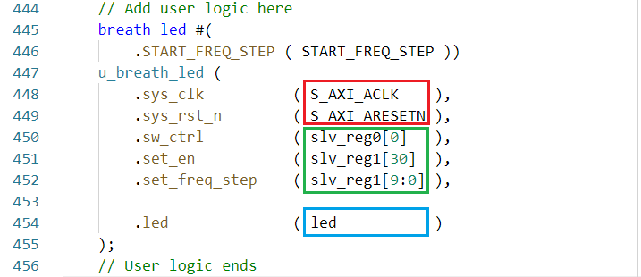

我们可以直接将基础设施中的时钟和复位接入功能模块，将基础设施中的寄存器接入功能模块的控制端口，将功能模块的输出端口作为本IP的对外输出

双击Vivado的`Sources`下的`component.xml`，对IP进行封装，

在`Categories`中可以对该IP所属的分类进行设置，

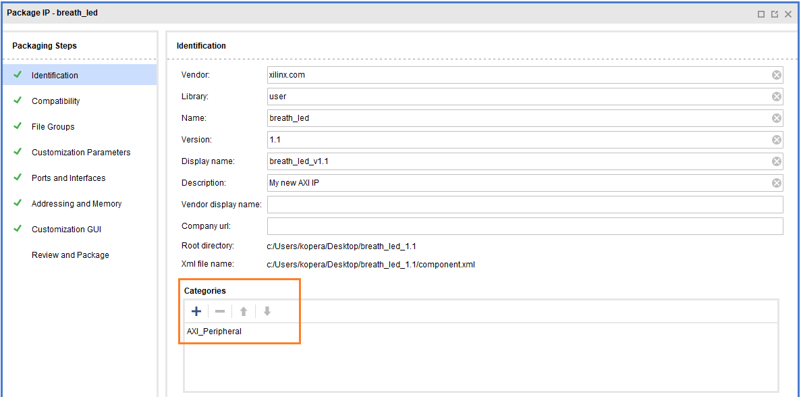

在`Compatibility`中可以对该IP所支持的器件家族进行设置，

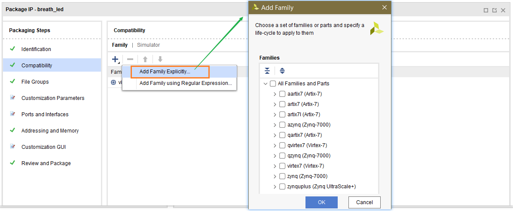

在`File Groups`中可以检查该IP所附带的源文件，

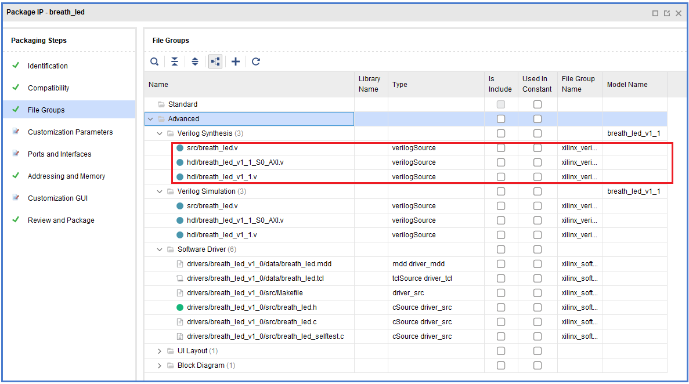

在`Customization Parameters`中可以对该IP的例化参数进行设置（包括参数描述、可选值、默认值等），

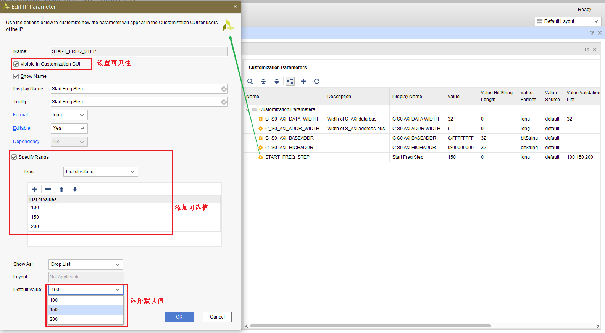

在`Ports and Interfaces`中可以对该IP的端口和接口进行设置（使用预先定义的接口时，端口会被自动分组），

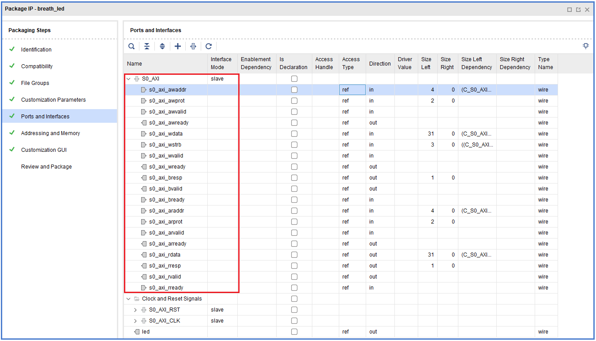

在`Customization GUI`中可以对双击该IP时呈现的界面进行设置，

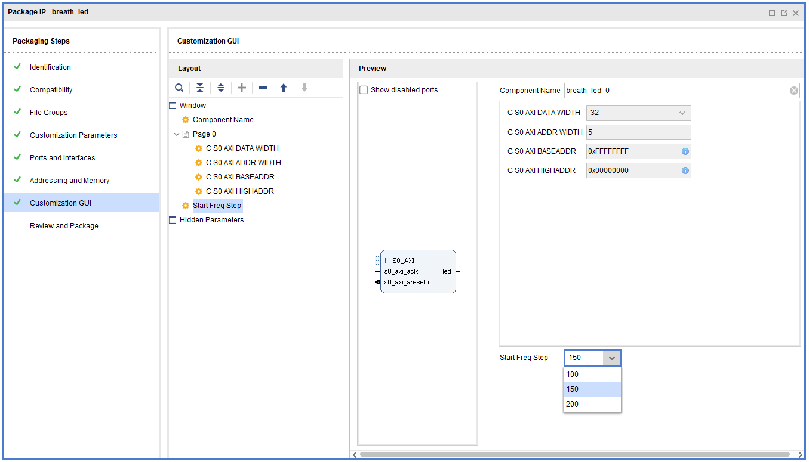

检查设置无误后，点击`Re-Package IP`对IP进行封装。

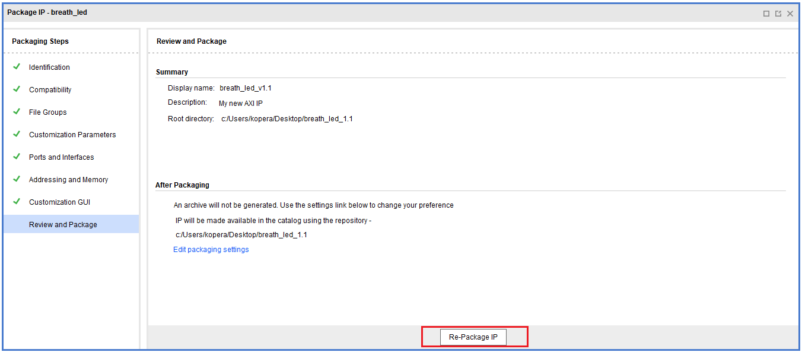

## 仿真

创建一个新工程，并将之前创建的IP核添加到`IP Repository `

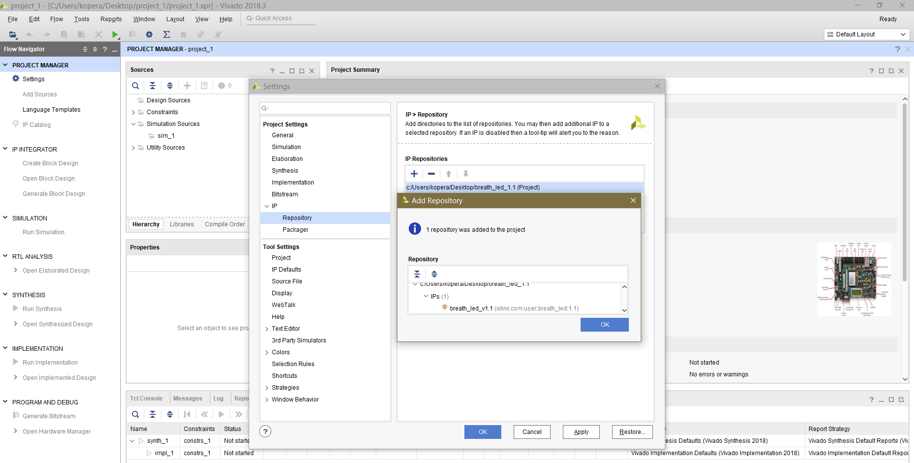

在`Tcl Console`中执行

```tcl
source C:/Users/kopera/Desktop/breath_led_1.1/example_designs/bfm_design/design.tcl
```

该示例工程的是基于Xilinx AXI VIP搭建的，其框图如下

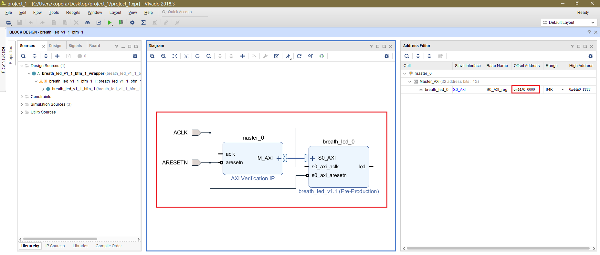

该工程自带有用于仿真的`tb`文件，启动仿真后，我们添加如下信号进行观察，

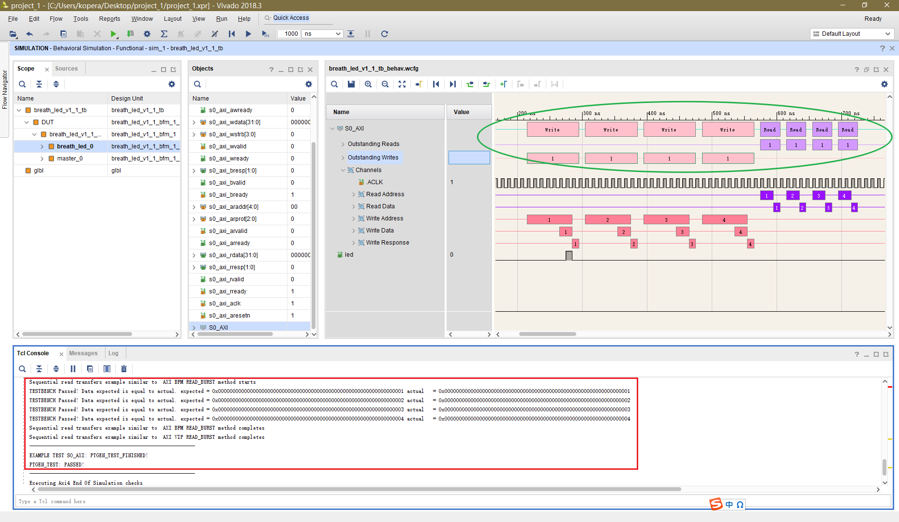

可见，该自动构建的仿真例程做了下面的事情：

- 主机发起了4次写事务
- 主机发起了4次读事务
- 将每次的读结果与预期值进行对比

接下来我们尝试对其`tb`进行修改，包括：

- 令主机发起9次写事务（从机内部共有8个寄存器），写入值为1、10、19、……（1+9\**N*）
- 令主机发起9次读事务（从机内部共有8个寄存器）
- 将每次的读结果与预期值进行对比

修改后的`tb`代码如下，

（该代码的编写大量调用了Xilinx AXI VIP所提供的API，阅读时需要有一点的SystemVerilog和UVM基础，VIP的使用可以参考

https://www.xilinx.com/support/documentation/ip_documentation/axi_vip/v1_1/pg267-axi-vip.pdf）

```verilog
`timescale 1ns / 1ps
`include "breath_led_v1_1_tb_include.svh"

import axi_vip_pkg::*;
import breath_led_v1_1_bfm_1_master_0_0_pkg::*;
 

module breath_led_v1_1_tb();

xil_axi_uint                            error_cnt = 0;
xil_axi_uint                            comparison_cnt = 0;
axi_transaction                         wr_transaction;   
axi_transaction                         rd_transaction;   
axi_monitor_transaction                 mst_monitor_transaction;  
axi_monitor_transaction                 master_moniter_transaction_queue[$];  
xil_axi_uint                            master_moniter_transaction_queue_size =0;  
axi_monitor_transaction                 mst_scb_transaction;  
axi_monitor_transaction                 passthrough_monitor_transaction;  
axi_monitor_transaction                 passthrough_master_moniter_transaction_queue[$];  
xil_axi_uint                            passthrough_master_moniter_transaction_queue_size =0;  
axi_monitor_transaction                 passthrough_mst_scb_transaction;  
axi_monitor_transaction                 passthrough_slave_moniter_transaction_queue[$];  
xil_axi_uint                            passthrough_slave_moniter_transaction_queue_size =0;  
axi_monitor_transaction                 passthrough_slv_scb_transaction;  
axi_monitor_transaction                 slv_monitor_transaction;  
axi_monitor_transaction                 slave_moniter_transaction_queue[$];  
xil_axi_uint                            slave_moniter_transaction_queue_size =0;  
axi_monitor_transaction                 slv_scb_transaction;  
xil_axi_uint                           mst_agent_verbosity = 0;  
xil_axi_uint                           slv_agent_verbosity = 0;  
xil_axi_uint                           passthrough_agent_verbosity = 0;  
bit                                     clock;
bit                                     reset;
integer result_slave;  
bit [31:0] S00_AXI_test_data[8:0];

localparam LC_AXI_BURST_LENGTH = 8; 
localparam LC_AXI_DATA_WIDTH = 32; 

integer                                 i; 
integer                                 j;  
xil_axi_uint                            trans_cnt_before_switch = 48;  
xil_axi_uint                            passthrough_cmd_switch_cnt = 0;  
event                                   passthrough_mastermode_start_event;  
event                                   passthrough_mastermode_end_event;  
event                                   passthrough_slavemode_end_event;  
xil_axi_uint                            mtestID;  
xil_axi_ulong                           mtestADDR;  
xil_axi_len_t                           mtestBurstLength;  
xil_axi_size_t                          mtestDataSize;   
xil_axi_burst_t                         mtestBurstType;   
xil_axi_lock_t                          mtestLOCK;  
xil_axi_cache_t                         mtestCacheType = 0;  
xil_axi_prot_t                          mtestProtectionType = 3'b000;  
xil_axi_region_t                        mtestRegion = 4'b000;  
xil_axi_qos_t                           mtestQOS = 4'b000;  
xil_axi_data_beat                       dbeat;  
xil_axi_data_beat [255:0]               mtestWUSER;   
xil_axi_data_beat                       mtestAWUSER = 'h0;  
xil_axi_data_beat                       mtestARUSER = 0;  
xil_axi_data_beat [255:0]               mtestRUSER;      
xil_axi_uint                            mtestBUSER = 0;  
xil_axi_resp_t                          mtestBresp;  
xil_axi_resp_t[255:0]                   mtestRresp;  
bit [63:0]                              mtestWDataL; 
bit [63:0]                              mtestRDataL; 
axi_transaction                         pss_wr_transaction;   
axi_transaction                         pss_rd_transaction;   
axi_transaction                         reactive_transaction;   
axi_transaction                         rd_payload_transaction;  
axi_transaction                         wr_rand;  
axi_transaction                         rd_rand;  
axi_transaction                         wr_reactive;  
axi_transaction                         rd_reactive;  
axi_transaction                         wr_reactive2;   
axi_transaction                         rd_reactive2;  
axi_ready_gen                           bready_gen;  
axi_ready_gen                           rready_gen;  
axi_ready_gen                           awready_gen;  
axi_ready_gen                           wready_gen;  
axi_ready_gen                           arready_gen;  
axi_ready_gen                           bready_gen2;  
axi_ready_gen                           rready_gen2;  
axi_ready_gen                           awready_gen2;  
axi_ready_gen                           wready_gen2;  
axi_ready_gen                           arready_gen2;  
xil_axi_payload_byte                    data_mem[xil_axi_ulong];  
breath_led_v1_1_bfm_1_master_0_0_mst_t          mst_agent_0;

  `BD_WRAPPER DUT(
      .ARESETN(reset), 
      .ACLK(clock) 
    ); 
  
initial begin
    mst_agent_0 = new("master vip agent",DUT.`BD_INST_NAME.master_0.inst.IF);//ms  
    mst_agent_0.vif_proxy.set_dummy_drive_type(XIL_AXI_VIF_DRIVE_NONE); 
    mst_agent_0.set_agent_tag("Master VIP"); 
    mst_agent_0.set_verbosity(mst_agent_verbosity); 
    mst_agent_0.start_master(); 
    $timeformat (-12, 1, " ps", 1);
end

initial begin
    reset <= 1'b0;
    #200ns;
    reset <= 1'b1;
    repeat (5) @(negedge clock); 
end

always #5 clock <= ~clock;

initial begin
    S_AXI_TEST ( );

    #1ns;
    $finish;
end

task automatic COMPARE_DATA; 
    input [(LC_AXI_BURST_LENGTH * LC_AXI_DATA_WIDTH)-1:0]expected; 
    input [(LC_AXI_BURST_LENGTH * LC_AXI_DATA_WIDTH)-1:0]actual; 
    begin 
        if (expected === 'hx || actual === 'hx) begin 
            $display("TESTBENCH ERROR! COMPARE_DATA cannot be performed with an expected or actual vector that is all 'x'!"); 
            result_slave = 0;    
            //$stop; 
        end 

        if (actual != expected) begin 
            $display("TESTBENCH ERROR! Data expected is not equal to actual.",     " expected = 0x%h",expected,     " actual   = 0x%h",actual); 
            result_slave = 0; 
            //$stop; 
        end else begin 
            $display("TESTBENCH Passed! Data expected is equal to actual.", 
                    " expected = 0x%h",expected,               " actual   = 0x%h",actual); 
        end 
    end 
endtask

task automatic S_AXI_TEST;  
begin   
    #1; 
    $display("Sequential write transfers example similar to  AXI BFM WRITE_BURST method starts"); 
    mtestID = 0; 
    mtestADDR = 64'h00000000; 
    mtestBurstLength = 0; 
    mtestDataSize = xil_axi_size_t'(xil_clog2(32/8)); 
    mtestBurstType = XIL_AXI_BURST_TYPE_INCR;  
    mtestLOCK = XIL_AXI_ALOCK_NOLOCK;  
    mtestCacheType = 0;  
    mtestProtectionType = 0;  
    mtestRegion = 0; 
    mtestQOS = 0; 
    result_slave = 1; 
    mtestWDataL[31:0] = 32'h00000001; 
    for(int i = 0; i < 9;i++) begin 
        S00_AXI_test_data[i] <= mtestWDataL[31:0];   
        mst_agent_0.AXI4LITE_WRITE_BURST( 
        mtestADDR, 
        mtestProtectionType, 
        mtestWDataL, 
        mtestBresp 
        );   
        mtestWDataL[31:0] = mtestWDataL[31:0] + 'd9; 
        mtestADDR = mtestADDR + 64'h4; 
     end 
     $display("Sequential write transfers example similar to  AXI BFM WRITE_BURST method completes"); 
     $display("Sequential read transfers example similar to  AXI BFM READ_BURST method starts"); 
     mtestID = 0; 
     mtestADDR = 64'h00000000; 
     mtestBurstLength = 0; 
     mtestDataSize = xil_axi_size_t'(xil_clog2(32/8)); 
     mtestBurstType = XIL_AXI_BURST_TYPE_INCR;  
     mtestLOCK = XIL_AXI_ALOCK_NOLOCK;  
     mtestCacheType = 0;  
     mtestProtectionType = 0;  
     mtestRegion = 0; 
     mtestQOS = 0; 
    for(int i = 0; i < 9;i++) begin 
        mst_agent_0.AXI4LITE_READ_BURST( 
              mtestADDR, 
              mtestProtectionType, 
              mtestRDataL, 
              mtestRresp 
            ); 
        mtestADDR = mtestADDR + 64'h4; 
        COMPARE_DATA(S00_AXI_test_data[i],mtestRDataL); 
    end 
     $display("Sequential read transfers example similar to  AXI BFM READ_BURST method completes"); 
     $display("Sequential read transfers example similar to  AXI VIP READ_BURST method completes"); 
     $display("---------------------------------------------------------"); 
     $display("EXAMPLE TEST S0_AXI: PTGEN_TEST_FINISHED!"); 
     if ( result_slave ) begin                    
       $display("PTGEN_TEST: PASSED!");                  
     end    else begin                                       
       $display("PTGEN_TEST: FAILED!");                  
     end                                
     $display("---------------------------------------------------------"); 
end 
endtask  

endmodule
```

仿真结果如下

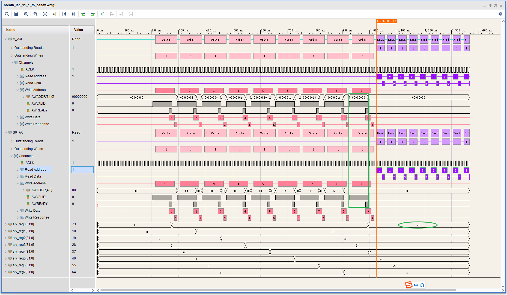

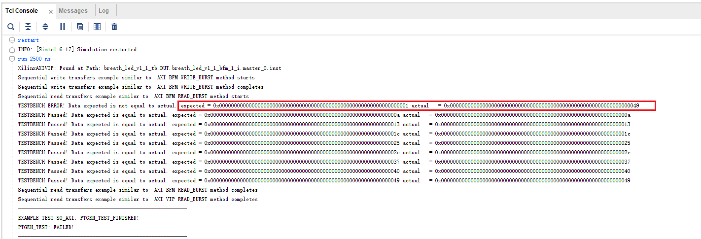

可以看到，由于**从机的地址线位宽**只有**5位**（即只能寻址8个32位寄存器），故主机发出的**第9次**写事务实际上修改了地址为`0x00`的寄存器的值