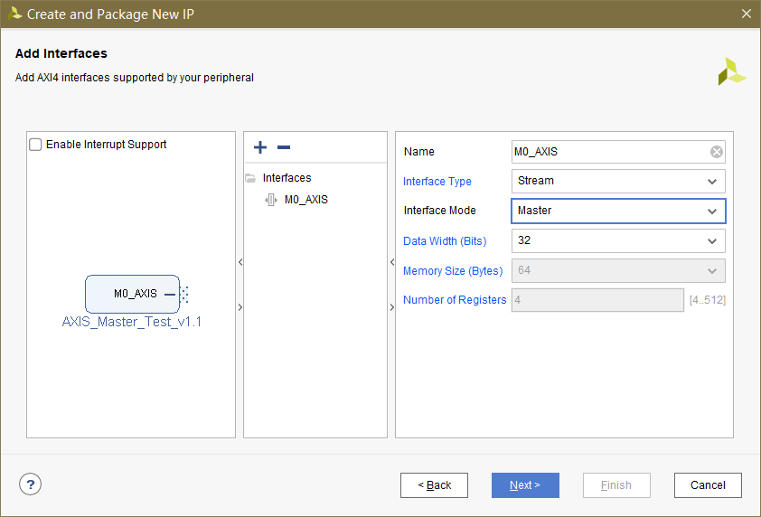
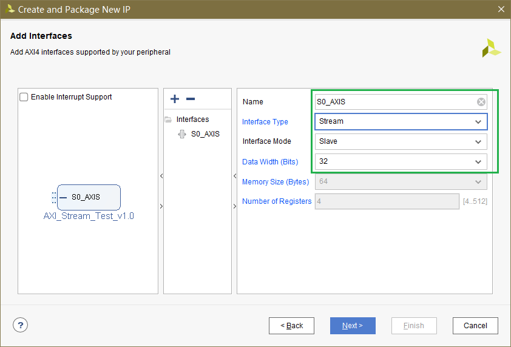
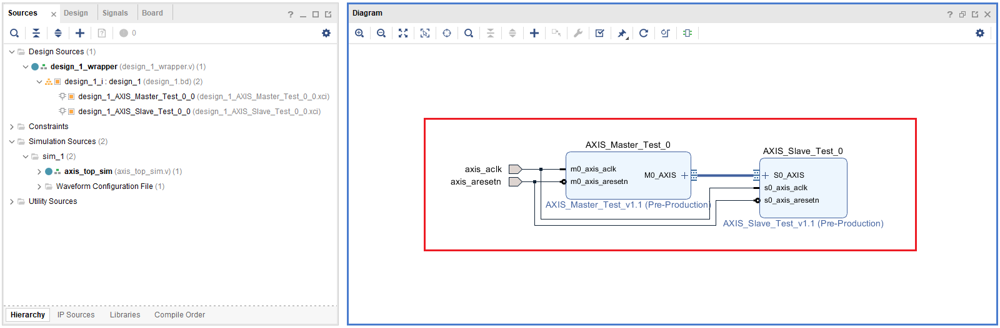
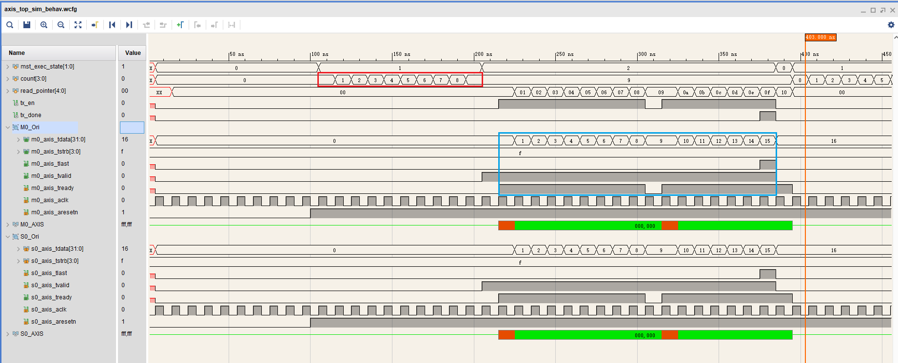
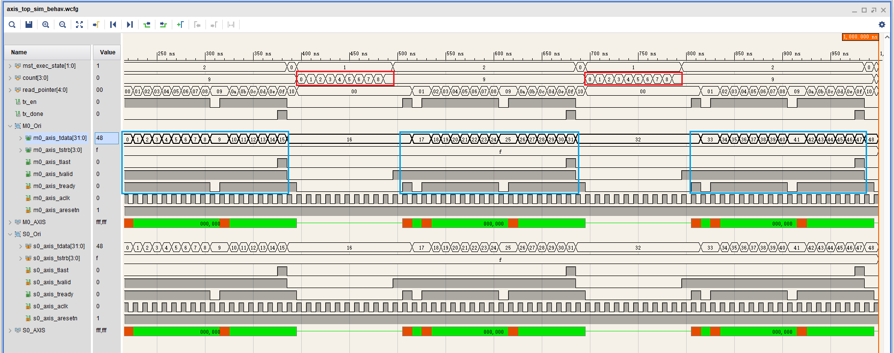
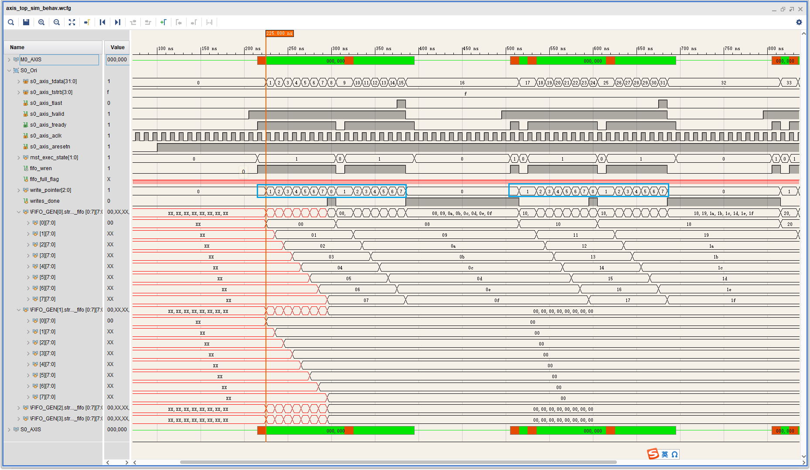

# 创建带AXI-Stream接口的IP并仿真

## 创建 

创建一个主接口的IP



创建一个从接口的IP



## 仿真

该示例工程的框图如下



想该工程添加用于仿真的`tb`文件，

```verilog
//***********************    File Info     ************************ 
// Project Name  : 
// Module Name   : axis_top_sim
// Created By    : kopera
// Description   : 
// Verilog Mode  : IEEE-2005
// Character Set : GB-2312
//************************ Revision History *********************** 
// Date       By        Version       Change Description            
// ----------------------------------------------------------------- 
// 22/02/06   kopera    v0.1          first try 
//***************************************************************** 
`timescale 1ns / 1ns

module axis_top_sim();

reg axis_aclk;
reg axis_aresetn;

design_1_wrapper DUT
    (
        .axis_aclk(axis_aclk),
        .axis_aresetn(axis_aresetn)
    );

initial begin
    axis_aclk = 1'b0;

    axis_aresetn = 1'b0;

    #100;

    axis_aresetn = 1'b1;
end

always begin
    #5 axis_aclk = ~axis_aclk;
end

endmodule
```

启动仿真后，我们添加如下信号进行观察，


可见，该模板IP的主机做了下面的事情：

- 复位时处在`状态0`，复位结束后进入`状态1`，等待32周期后进入`状态2`，
- `状态2`下发起**一次**传输事务，长度为9，数据依次为0、1、2、…、8
- 之后不发起传输事务，但状态机仍在跳转（存在**bug**）

接下来我们尝试对其**IP核代码**进行修改，包括：

- 复位时处在`状态0`，复位结束后进入`状态1`，等待10周期后进入`状态2`，
- `状态2`下发起**一次**传输事务，长度为16，数据依次为0、1、2、…、15
- 之后继续发起类似传输事务，发送的数据持续递增

修改后的代码

`AXIS_Master_Test_v1_1_M0_AXIS.v`

```verilog

`timescale 1 ns / 1 ps

module AXIS_Master_Test_v1_1_M0_AXIS #
       (
           // Width of S_AXIS address bus. The slave accepts the read and write addresses of width C_M_AXIS_TDATA_WIDTH.
           parameter integer C_M_AXIS_TDATA_WIDTH    = 32,
           // Start count is the number of clock cycles the master will wait before initiating/issuing any transaction.
           parameter integer C_M_START_COUNT    = 32
       )
       (
           // Global ports
           input wire M_AXIS_ACLK,
           input wire M_AXIS_ARESETN,
           // Master Stream Ports. TVALID indicates that the master is driving a valid transfer, A transfer takes place when both TVALID and TREADY are asserted.
           output wire M_AXIS_TVALID,
           // TDATA is the primary payload that is used to provide the data that is passing across the interface from the master.
           output wire [C_M_AXIS_TDATA_WIDTH-1 : 0] M_AXIS_TDATA,
           // TSTRB is the byte qualifier that indicates whether the content of the associated byte of TDATA is processed as a data byte or a position byte.
           output wire [(C_M_AXIS_TDATA_WIDTH/8)-1 : 0] M_AXIS_TSTRB,
           // TLAST indicates the boundary of a packet.
           output wire M_AXIS_TLAST,
           // TREADY indicates that the slave can accept a transfer in the current cycle.
           input wire M_AXIS_TREADY
       );

// Total number of output data
localparam NUMBER_OF_OUTPUT_WORDS = 16;

// function called clogb2 that returns an integer which has the
// value of the ceiling of the log base 2.

function integer clogb2 (input integer bit_depth);
    begin
        for(clogb2=0; bit_depth>0; clogb2=clogb2+1)
            bit_depth = bit_depth >> 1;
    end
endfunction

// WAIT_COUNT_BITS is the width of the wait counter.
localparam integer WAIT_COUNT_BITS = clogb2(C_M_START_COUNT-1);

// bit_num gives the minimum number of bits needed to address 'depth' size of FIFO.
localparam bit_num = clogb2(NUMBER_OF_OUTPUT_WORDS);

// Define the states of state machine
// The control state machine oversees the writing of input streaming data to the FIFO,
// and outputs the streaming data from the FIFO

parameter [1:0] IDLE = 2'b00, // This is the initial/idle state
          INIT_COUNTER = 2'b01, // This state initializes the counter, once
          // the counter reaches C_M_START_COUNT count,
          // the state machine changes state to SEND_STREAM
          SEND_STREAM = 2'b10; // In this state the

// stream data is output through M_AXIS_TDATA
// State variable
reg [1:0] mst_exec_state;

// Example design FIFO read pointer
reg [bit_num-1:0] read_pointer;

reg [C_M_AXIS_TDATA_WIDTH-1 : 0] axis_tdata;

// AXI Stream internal signals
//wait counter. The master waits for the user defined number of clock cycles before initiating a transfer.
reg [WAIT_COUNT_BITS-1 : 0]     count;

//streaming data valid
wire     axis_tvalid;

//Last of the streaming data
wire     axis_tlast;
wire     tx_en;

//The master has issued all the streaming data stored in FIFO
wire     tx_done;

// I/O Connections assignments
assign M_AXIS_TVALID   = axis_tvalid;
assign M_AXIS_TDATA    = axis_tdata;
assign M_AXIS_TLAST    = axis_tlast;
assign M_AXIS_TSTRB    = {(C_M_AXIS_TDATA_WIDTH/8){1'b1}};

// Control state machine implementation
always @(posedge M_AXIS_ACLK) begin
    if (!M_AXIS_ARESETN) // Synchronous reset (active low)
    begin
        mst_exec_state <= IDLE;
        count <= 0;
    end
    else
    case (mst_exec_state)
        IDLE: begin
            mst_exec_state <= INIT_COUNTER;
            count <= 0;
        end
        INIT_COUNTER:
            // The slave starts accepting tdata when
            // there tvalid is asserted to mark the
            // presence of valid streaming data
            if ( count == C_M_START_COUNT - 1 ) begin
                mst_exec_state <= SEND_STREAM;
            end
            else begin
                count <= count + 1;
                mst_exec_state <= INIT_COUNTER;
            end
        SEND_STREAM:
            // The example design streaming master functionality starts
            // when the master drives output tdata from the FIFO and the slave
            // has finished storing the S_AXIS_TDATA
            if (tx_done) begin
                mst_exec_state <= IDLE;
            end
            else begin
                mst_exec_state <= SEND_STREAM;
            end
    endcase
end


//tvalid generation
//axis_tvalid is asserted when the control state machine's state is SEND_STREAM and
//number of output streaming data is less than the NUMBER_OF_OUTPUT_WORDS.
assign axis_tvalid = ((mst_exec_state == SEND_STREAM) && (read_pointer < NUMBER_OF_OUTPUT_WORDS));

// AXI tlast generation
assign axis_tlast = (read_pointer == NUMBER_OF_OUTPUT_WORDS - 1'b1)&& tx_en;
assign tx_done = axis_tlast;


//FIFO read enable generation
assign tx_en = M_AXIS_TREADY && axis_tvalid;

// Streaming output data is read from FIFO
always @( posedge M_AXIS_ACLK ) begin
    if(mst_exec_state == IDLE) begin
        read_pointer <= 0;
    end
    else if (tx_en) begin
        read_pointer <= read_pointer + 'b1;
    end
end

always @( posedge M_AXIS_ACLK ) begin
    if(!M_AXIS_ARESETN) begin
        axis_tdata <= 0;
    end
    else if (tx_en) begin
        axis_tdata <= axis_tdata + 'b1;
    end
end


endmodule
```

设置参数


仿真结果如下






分析`AXIS_Slave_Test_v1_1_S0_AXIS.v`

```verilog
`timescale 1 ns / 1 ps

module AXIS_Slave_Test_v1_1_S0_AXIS #
       (
           // Users to add parameters here

           // User parameters ends
           // Do not modify the parameters beyond this line

           // AXI4Stream sink: Data Width
           parameter integer C_S_AXIS_TDATA_WIDTH	= 32
       )
       (
           // Users to add ports here

           // User ports ends
           // Do not modify the ports beyond this line

           // AXI4Stream sink: Clock
           input wire  S_AXIS_ACLK,
           // AXI4Stream sink: Reset
           input wire  S_AXIS_ARESETN,
           // Ready to accept data in
           output wire  S_AXIS_TREADY,
           // Data in
           input wire [C_S_AXIS_TDATA_WIDTH-1 : 0] S_AXIS_TDATA,
           // Byte qualifier
           input wire [(C_S_AXIS_TDATA_WIDTH/8)-1 : 0] S_AXIS_TSTRB,
           // Indicates boundary of last packet
           input wire  S_AXIS_TLAST,
           // Data is in valid
           input wire  S_AXIS_TVALID
       );
// function called clogb2 that returns an integer which has the
// value of the ceiling of the log base 2.
function integer clogb2 (input integer bit_depth);
    begin
        for(clogb2=0; bit_depth>0; clogb2=clogb2+1)
            bit_depth = bit_depth >> 1;
    end
endfunction

// Total number of input data.
localparam NUMBER_OF_INPUT_WORDS  = 8;
// bit_num gives the minimum number of bits needed to address 'NUMBER_OF_INPUT_WORDS' size of FIFO.
localparam bit_num  = clogb2(NUMBER_OF_INPUT_WORDS-1);
// Define the states of state machine
// The control state machine oversees the writing of input streaming data to the FIFO,
// and outputs the streaming data from the FIFO
parameter [1:0] IDLE = 2'b0,        // This is the initial/idle state

          WRITE_FIFO  = 2'b1; // In this state FIFO is written with the
// input stream data S_AXIS_TDATA
wire  	axis_tready;
// State variable
reg [1:0] mst_exec_state;
// FIFO implementation signals
genvar byte_index;
// FIFO write enable
wire fifo_wren;
// FIFO full flag
reg fifo_full_flag;
// FIFO write pointer
reg [bit_num-1:0] write_pointer;
// sink has accepted all the streaming data and stored in FIFO
reg writes_done;
// I/O Connections assignments

assign S_AXIS_TREADY	= axis_tready;
// Control state machine implementation
always @(posedge S_AXIS_ACLK) begin
    if (!S_AXIS_ARESETN)
        // Synchronous reset (active low)
    begin
        mst_exec_state <= IDLE;
    end
    else
    case (mst_exec_state)
        IDLE:
            // The sink starts accepting tdata when
            // there tvalid is asserted to mark the
            // presence of valid streaming data
            if (S_AXIS_TVALID) begin
                mst_exec_state <= WRITE_FIFO;
            end
            else begin
                mst_exec_state <= IDLE;
            end
        WRITE_FIFO:
            // When the sink has accepted all the streaming input data,
            // the interface swiches functionality to a streaming master
            if (writes_done) begin
                mst_exec_state <= IDLE;
            end
            else begin
                // The sink accepts and stores tdata
                // into FIFO
                mst_exec_state <= WRITE_FIFO;
            end

    endcase
end
// AXI Streaming Sink
//
// The example design sink is always ready to accept the S_AXIS_TDATA  until
// the FIFO is not filled with NUMBER_OF_INPUT_WORDS number of input words.
assign axis_tready = mst_exec_state == WRITE_FIFO;

always@(posedge S_AXIS_ACLK) begin
    if(!S_AXIS_ARESETN) begin
        write_pointer <= 0;
        writes_done <= 1'b0;
    end
    else
        if (write_pointer <= NUMBER_OF_INPUT_WORDS-1) begin
            if (fifo_wren) begin
                // write pointer is incremented after every write to the FIFO
                // when FIFO write signal is enabled.
                write_pointer <= write_pointer + 1;
                writes_done <= 1'b0;
            end
            if ((write_pointer == NUMBER_OF_INPUT_WORDS-1)|| S_AXIS_TLAST) begin
                // reads_done is asserted when NUMBER_OF_INPUT_WORDS numbers of streaming data
                // has been written to the FIFO which is also marked by S_AXIS_TLAST(kept for optional usage).
                writes_done <= 1'b1;
            end
        end
end

// FIFO write enable generation
assign fifo_wren = S_AXIS_TVALID && axis_tready;

// FIFO Implementation
generate
    for(byte_index=0; byte_index<= (C_S_AXIS_TDATA_WIDTH/8-1); byte_index=byte_index+1) begin:FIFO_GEN

        reg  [(C_S_AXIS_TDATA_WIDTH/4)-1:0] stream_data_fifo [0 : NUMBER_OF_INPUT_WORDS-1];

        // Streaming input data is stored in FIFO

        always @( posedge S_AXIS_ACLK ) begin
            if (fifo_wren)// && S_AXIS_TSTRB[byte_index])
            begin
                stream_data_fifo[write_pointer] <= S_AXIS_TDATA[(byte_index*8+7) -: 8];
            end
        end
    end
endgenerate

// Add user logic here

// User logic ends

endmodule
```

从机内部的FIFO空间为8，FIFO的写使能信号 **WREN = TVALID && TREADY**;

